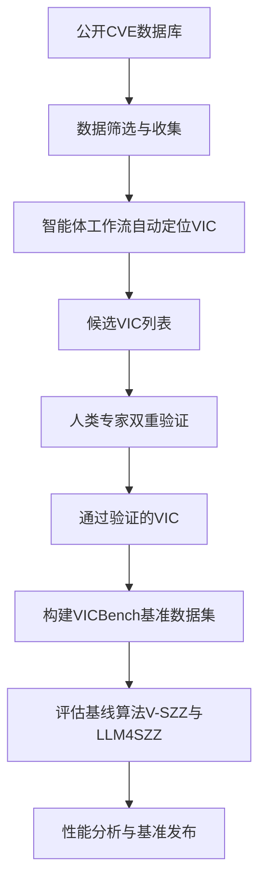
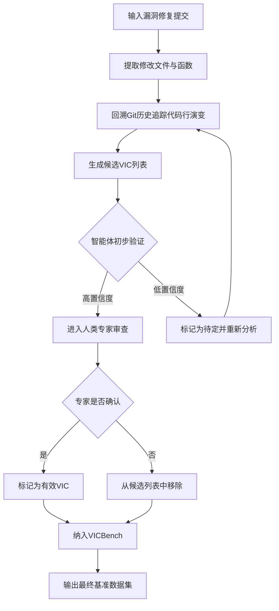
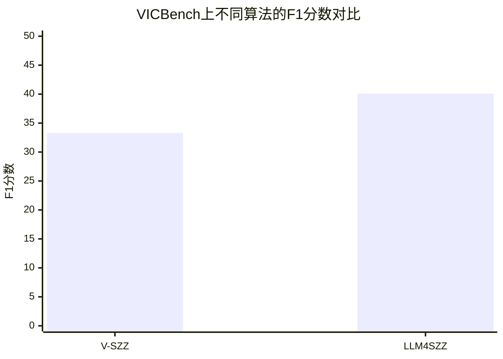

# VICBench: A Multi-Language Benchmark for Code Vulnerability Detection

> 本文由 paper-daily 使用 DeepSeek 自动生成，仅供快速了解论文；关键结论请以原文为准。

[论文原文](https://arxiv.org/abs/2608.12246) · [PDF](https://arxiv.org/pdf/2608.12246) · [源文件](https://github.com/vsvnakers/paper-daily/blob/master/essay_read/2026-08-16/2608.12246.md)

> VICBench 通过双重验证机制构建了多语言、高复杂度的漏洞引入提交基准，揭示了现有检测算法的性能瓶颈。

## 基本信息

| 属性 | 内容 |
|------|------|
| **作者** | Jin Lu, Xuening Han, Yang Zhong, Lin Tan, Kevin Luo, Andrew Gacek, Neha Rungta |
| **来源** | [arXiv:2608.12246](https://arxiv.org/abs/2608.12246) |
| **发布日期** | 2026-08-12 |
| **抓取领域** | 深度学习编译器/IR |
| **学科方向** | 安全加密 · 人工智能 · 自然语言处理 |
| **arXiv 分类** | cs.CR, cs.AI, cs.CL, cs.SE |
| **适用层次** | 前沿 |
| **标签** | 漏洞引入提交, 基准数据集, 多语言, 智能体工作流, 漏洞检测 |
| **PDF** | [在线阅读](https://arxiv.org/pdf/2608.12246) |
| **代码仓库** | 暂无

---

## 问题的初衷（Why - 为什么要做这个研究）

【问题的初衷】软件安全漏洞检测是保障系统安全的关键环节，而评估漏洞检测工具的性能需要高质量的基准数据集。论文指出，最理想的基准数据应包含漏洞引入提交（Vulnerability-Inducing Commits, VICs），即首次将漏洞引入代码库的提交记录。VICs 对于确定受影响的软件版本范围、追溯漏洞根源以及评估检测工具的召回能力至关重要。然而，现有漏洞数据集存在三大显著缺陷：其一，编程语言覆盖范围有限，大多集中于单一语言如 Java 或 C，缺乏对 Python、C++ 等主流语言的支持；其二，补丁复杂度受限，现有数据集中的漏洞修复往往过于简单，无法反映真实世界中大型、跨模块的复杂漏洞修复场景；其三，项目范围狭窄，数据多来自少数几个知名项目，缺乏多样性。这些缺陷导致基于现有数据集的评估结果难以泛化到真实应用场景，也无法准确衡量检测工具在处理复杂漏洞时的真实能力。因此，构建一个覆盖多语言、包含复杂真实漏洞修复、且经过严格验证的基准数据集，对于推动漏洞检测领域的发展具有迫切的现实意义。

---

## 问题的解决（What - 提出了什么方案）

【问题的解决】针对上述问题，论文提出了 VICBench 基准数据集，其核心思路是结合人类专家与智能体工作流（Agentic Workflow）的双重标注机制，从真实世界的代码提交历史中筛选并验证漏洞引入提交。该方法首先从公开的 CVE（Common Vulnerabilities and Exposures）列表中筛选出涉及 Python、Java、C++ 的漏洞案例，然后利用一个由大语言模型（LLM）驱动的智能体工作流自动定位潜在的漏洞引入提交，并生成初步的验证报告。随后，人类专家对智能体的输出进行严格审查和修正，确保每个 VIC 的准确性。这一过程不仅大幅提高了标注效率，还保证了数据的高质量。VICBench 最终包含 100 个经过验证的 VIC，对应 100 个 CVE，覆盖 88 个不同项目、48 种 CWE（Common Weakness Enumeration）类型。其核心创新点在于：一是数据规模与复杂度的突破，平均修复补丁达 38.6 行，对应 VIC 达 252.5 行，远超现有数据集；二是通过双重标注机制确保了数据的可靠性和可复现性；三是提供了对现有 SOTA 算法的基准评估，揭示了其性能瓶颈。

---

## 技术方法详解（How - 怎么实现的）

【技术方法详解】
- **数据收集与筛选**：从 NVD（National Vulnerability Database）等公开源收集 CVE 记录，筛选出影响 Python、Java、C++ 项目的漏洞，并确保这些项目有公开的 Git 仓库可供分析。
- **智能体工作流（Agentic Workflow）**：设计了一个由 LLM 驱动的多步骤智能体流程，用于自动定位 VIC。该流程包括：
    1. **提交历史分析**：智能体首先分析漏洞修复提交（Fixing Commit），提取其修改的文件和函数。
    2. **候选提交识别**：基于修复提交中修改的代码行，智能体回溯 Git 历史，利用 `git log -L` 等命令追踪这些代码行的演变，找出所有可能引入这些代码的提交。
    3. **初步验证**：智能体对每个候选提交进行代码审查，判断其是否真正引入了漏洞，并给出置信度评分和理由。
- **人类专家双重验证**：所有由智能体生成的候选 VIC 均由至少两名人类安全专家进行独立审查。专家需确认：
    1. 该提交确实引入了漏洞，而非仅仅是代码重构或功能添加。
    2. 该漏洞与对应的 CVE 描述一致。
    3. 该提交是可编译且可运行的，以确保后续评估的可行性。
- **基准构建**：最终构建的 VICBench 包含 100 个 VIC，每个 VIC 包含完整的提交元数据（如 commit hash、作者、时间戳）、修改的代码 diff、以及对应的 CVE 和 CWE 信息。
- **评估协议**：定义了标准的评估任务，即给定一个漏洞修复提交，要求检测工具找出其对应的 VIC。评估指标采用 F1 分数，综合考虑精确率和召回率。
- **基线算法对比**：选取了 V-SZZ 和 LLM4SZZ 两种 SOTA 算法作为基线，在 VICBench 上进行评估，以验证基准的挑战性和有效性。

## 系统架构图

## 方法流程图

## 核心公式与算法

【核心公式】
VICBench 的评估主要基于精确率（Precision）、召回率（Recall）和 F1 分数。

- **精确率**：$\text{Precision} = \frac{TP}{TP + FP}$，其中 $TP$ 表示正确识别的 VIC 数量，$FP$ 表示错误识别的 VIC 数量。
- **召回率**：$\text{Recall} = \frac{TP}{TP + FN}$，其中 $FN$ 表示未被识别出的真实 VIC 数量。
- **F1 分数**：$F1 = 2 \times \frac{\text{Precision} \times \text{Recall}}{\text{Precision} + \text{Recall}}$，综合衡量精确率和召回率的调和平均值。

---

## 应用场景（Where - 在哪落地）

【应用场景】
1. **软件供应链安全审计**：在 DevSecOps 流程中，安全团队可以使用 VICBench 来评估和选择最适合其技术栈（如 Python 或 Java）的漏洞检测工具。通过 VICBench 的标准化评估，团队可以量化不同工具在识别复杂漏洞引入提交上的能力，从而选择召回率更高、误报率更低的工具，减少人工审查代码提交的工作量，提升安全审计的效率。
2. **漏洞检测模型的训练与基准测试**：对于研究机构和企业 AI 实验室，VICBench 提供了一个高质量的基准数据集，用于训练和微调基于深度学习的漏洞检测模型。例如，可以基于 VICBench 中的 VIC 和修复提交对，训练一个代码变更分类模型，使其能够学习漏洞引入的代码模式。同时，VICBench 也可作为标准测试集，用于公平比较不同模型（如 CodeBERT、GraphCodeBERT 等）在漏洞引入检测任务上的性能，推动该领域的研究进展。
3. **学术研究与算法改进**：在学术界，VICBench 为 SZZ 算法及其变体（如 V-SZZ、LLM4SZZ）的改进提供了实验平台。研究人员可以分析 VICBench 中算法失败的案例，针对性地设计新的启发式规则或引入更先进的代码语义分析技术，以提高 VIC 定位的准确性。此外，VICBench 的多语言特性也支持跨语言漏洞检测的研究。

---

## 具体技术细节示例（How in Action - 算法如何执行）

【具体技术细节示例】
假设我们有一个 CVE 记录，涉及一个 Python 项目 `example_project` 的某个漏洞。

**输入**：
- 漏洞修复提交（Fixing Commit）的 hash 为 `abc123`，该提交修改了文件 `utils.py` 中的 `parse_data` 函数，修复了一个命令注入漏洞。
- 修改的代码行：在 `parse_data` 函数中，将 `os.system(user_input)` 替换为 `subprocess.run(user_input, shell=False)`。

**算法执行步骤**：
1. **提取修改信息**：智能体解析提交 `abc123`，提取出修改的文件 `utils.py` 和函数 `parse_data`。
2. **回溯代码历史**：智能体执行 `git log -L :parse_data:utils.py` 命令，追踪 `parse_data` 函数中 `os.system(user_input)` 这一行代码的历史。
3. **生成候选提交**：假设 `git log` 返回了三个提交，分别修改过这一行代码：
   - 提交 `def456`：最初添加了 `os.system(user_input)` 这行代码。
   - 提交 `ghi789`：重构了变量名，但逻辑未变。
   - 提交 `jkl012`：添加了注释。
4. **智能体初步验证**：智能体分析这三个提交，认为 `def456` 是首次引入该行代码的提交，且该代码行存在命令注入风险，因此将 `def456` 标记为高置信度候选 VIC。对于 `ghi789` 和 `jkl012`，智能体判断其未改变代码逻辑，不引入新漏洞，标记为低置信度。
5. **人类专家审查**：人类专家审查提交 `def456`，确认该提交在 `parse_data` 函数中新增了 `os.system(user_input)` 调用，且未对 `user_input` 进行任何过滤，确实引入了命令注入漏洞，与 CVE 描述一致。专家批准该提交为有效 VIC。
6. **输出**：算法输出提交 `def456` 作为该 CVE 对应的漏洞引入提交。

**最终结果**：在评估时，如果检测工具成功输出了 `def456`，则记为一次正确识别（TP）；如果输出了 `ghi789`，则记为一次错误识别（FP）；如果未能输出任何提交，则记为一次漏报（FN）。

---

## 实验结果（Results - 效果如何）

【实验结果】论文在构建的 VICBench 基准上评估了两种最先进的漏洞引入提交识别算法：V-SZZ 和 LLM4SZZ。实验结果表明，这两种算法的性能均不理想，F1 分数分别仅为 33.3% 和 40.1%。这意味着，即便使用当前最先进的方法，在 VICBench 上识别漏洞引入提交仍然存在大量错误，需要大量的人工干预和修正。这一结果有力地证明了 VICBench 的挑战性，它包含了比现有数据集更复杂、更真实的漏洞修复场景，能够有效区分不同算法的性能差异。此外，论文还分析了 VICBench 的统计特征，如平均补丁大小为 38.6 行，平均 VIC 大小为 252.5 行，远大于现有数据集（如 VulnFix 等），表明其覆盖了更复杂的代码变更模式。

## 实验结果可视化

---

## 优势与不足

【优势与不足】
- **优势**：
    1. **多语言覆盖**：VICBench 涵盖了 Python、Java、C++ 三种主流编程语言，显著优于仅覆盖单一语言的现有数据集，增强了基准的泛化能力。
    2. **高复杂度与真实性**：数据来源于 88 个真实项目，包含平均 252.5 行的复杂代码变更，更贴近实际开发中的漏洞引入场景，能更严格地检验检测工具的性能。
    3. **严格的双重验证机制**：结合智能体自动化和人类专家审查，确保了每个 VIC 的准确性和可靠性，为社区提供了高质量的标注数据。
- **不足**：
    1. **数据规模有限**：虽然覆盖了 100 个 CVE，但对于深度学习模型而言，100 个样本的规模仍然偏小，可能不足以充分训练或微调复杂的检测模型。
    2. **项目与漏洞类型偏差**：数据主要来源于能够通过自动化流程成功定位 VIC 的项目，可能存在选择偏差，未能完全代表所有类型的漏洞和项目结构。

---

## 相关工作

【相关工作】
- **V-SZZ 算法**：SZZ 算法的变体，用于从版本控制历史中自动定位漏洞引入提交，是本文的主要对比基线之一。
- **LLM4SZZ**：利用大语言模型增强 SZZ 算法，通过代码语义理解提高 VIC 定位的准确性，同样是本文的对比基线。
- **VulnFix 数据集**：一个包含漏洞修复提交的数据集，但主要关注修复本身，而非引入漏洞的提交，且语言覆盖和复杂度不及 VICBench。
- **Big-Vul 数据集**：一个大规模漏洞数据集，包含 CVE 信息，但缺乏对 VIC 的精确标注，且补丁复杂度较低。
- **智能体工作流（Agentic Workflow）**：利用 LLM 驱动的多步骤自动化流程进行代码分析，本文将其应用于 VIC 的初步筛选，展示了 LLM 在软件工程自动化中的新应用。

---

## 未来研究方向

【未来方向】
1. **数据规模扩展与自动化验证**：未来可以进一步扩大 VICBench 的规模，覆盖更多编程语言（如 Go、Rust）和更多 CVE 记录。同时，研究如何利用更先进的智能体工作流减少对人类专家的依赖，实现更大规模的自动化验证，同时保证数据质量。
2. **基于 VICBench 的检测模型研究**：利用 VICBench 作为训练和测试数据，开发专门针对漏洞引入提交检测的深度学习模型。可以探索结合代码结构信息（如抽象语法树 AST）和语义信息（如预训练模型表示）的方法，以提高在复杂代码变更上的检测性能。
3. **动态分析与漏洞利用验证**：当前 VICBench 主要基于静态代码分析验证漏洞。未来可以结合动态分析技术，为每个 VIC 生成可执行的漏洞利用样例（Proof of Concept, PoC），从而验证漏洞的真实可利用性，为检测工具提供更全面的评估维度。

---

## 一句话总结

> VICBench 通过双重验证机制构建了多语言、高复杂度的漏洞引入提交基准，揭示了现有检测算法的性能瓶颈。

---

*本解读由 DeepSeek AI 自动生成，仅供参考。*
