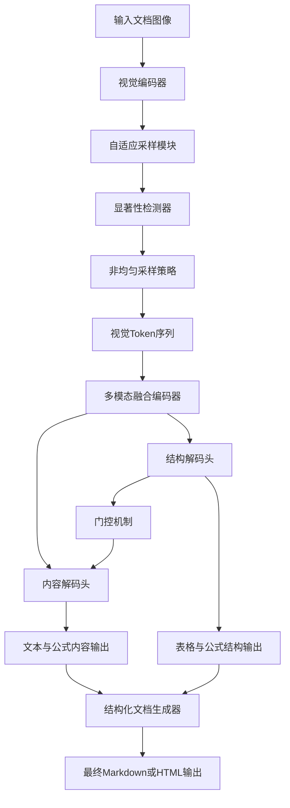
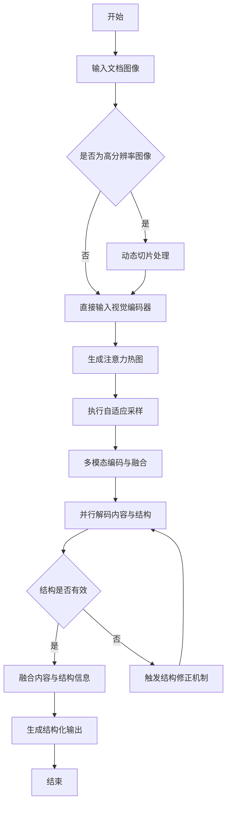
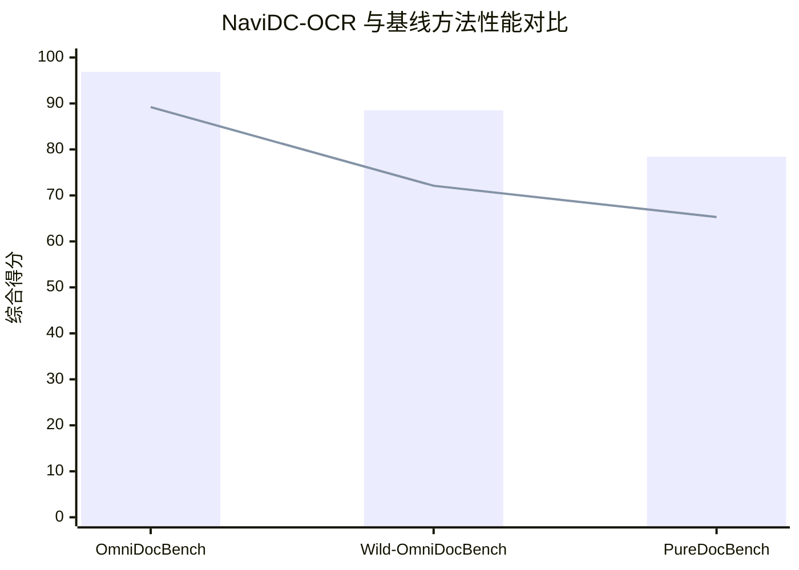

# NaviDC-OCR: Navigating Document Parsing Across Digital and Camera-Captured Documents

> 本文由 paper-daily 使用 DeepSeek 自动生成，仅供快速了解论文；关键结论请以原文为准。

[论文原文](https://arxiv.org/abs/2608.12898) · [PDF](https://arxiv.org/pdf/2608.12898) · [源文件](https://github.com/vsvnakers/paper-daily/blob/master/essay_read/2026-08-16/2608.12898.md)

> NaviDC-OCR通过形变感知、自适应采样和内容-结构解耦学习，实现了对数字与拍摄文档的高鲁棒性统一解析。

## 基本信息

| 属性 | 内容 |
|------|------|
| **作者** | Peng Cai, Zhaofan Zou, Shifa Liu, Yikun Wang, Jiawei Tang, Kaicheng Yang, Meng Tong, Zhongjiang He, Hao Sun |
| **来源** | [arXiv:2608.12898](https://arxiv.org/abs/2608.12898) |
| **发布日期** | 2026-08-13 |
| **抓取领域** | 多模态/视觉-语言 |
| **学科方向** | 计算机视觉 · 人工智能 |
| **arXiv 分类** | cs.CV, cs.AI |
| **适用层次** | 进阶 |
| **标签** | 文档解析, 视觉语言模型, 几何畸变鲁棒性, 结构建模, 自适应采样 |
| **PDF** | [在线阅读](https://arxiv.org/pdf/2608.12898) |
| **代码仓库** | 暂无

---

## 问题的初衷（Why - 为什么要做这个研究）

【问题的初衷】文档解析（Document Parsing）旨在将非结构化的文档（如PDF扫描件、手机拍摄的文档照片等）转化为结构化的机器可读表示（如Markdown、HTML或JSON），是办公自动化、知识库构建和智能问答系统的基础环节。近年来，基于视觉语言模型（Vision-Language Models, VLMs）的方法在该领域取得了显著进展，但现有方法仍面临两大核心挑战。第一，解耦式（Decoupled）方法通常先进行版面分析（Layout Analysis），再对每个区域进行内容识别。这种流水线架构在应对相机拍摄文档时存在严重缺陷：由于拍摄角度、透视畸变（Perspective Distortion）和光照不均等因素，版面检测模块极易出错，且这种几何误差会沿着流水线逐级传播，形成级联错误（Cascading Errors），导致最终解析结果质量急剧下降。第二，端到端（End-to-End）VLM方法虽然缓解了对显式版面检测的依赖，但在处理高分辨率文档时，往往面临冗余生成（Redundant Generation）、幻觉（Hallucination）以及结构推理能力不足的问题。具体而言，模型可能重复输出同一段落，生成文档中不存在的内容，或者无法准确理解复杂的表格嵌套和公式层级结构。因此，如何设计一个既能鲁棒应对几何畸变，又能精确建模复杂文档结构的统一框架，成为当前文档解析领域亟待解决的关键问题。

---

## 问题的解决（What - 提出了什么方案）

【问题的解决】针对上述挑战，论文提出了NaviDC-OCR，一个面向数字文档与相机拍摄文档的统一解析框架。其核心解决思路是摒弃传统的解耦式流水线，转而构建一个端到端的VLM框架，并将几何感知与结构建模能力直接注入模型内部。具体而言，NaviDC-OCR通过三项关键创新来解决上述问题：首先，引入形变感知学习（Deformation-Aware Learning），通过在训练阶段模拟相机拍摄产生的透视变换、旋转和弯曲等几何畸变，迫使VLM学习到对几何形变鲁棒的特征表示，从而从根本上缓解了级联错误问题。其次，提出自适应采样机制（Adaptive Sampling Mechanism），该机制能够根据文档内容的复杂程度动态调整视觉特征的采样密度，在保证高分辨率细节不丢失的前提下，有效减少冗余计算和生成。最后，设计了内容-结构解耦学习策略（Content-Structure Decoupled Learning），该策略将文档解析任务显式分解为内容识别（如文本、公式）与结构建模（如表格行列关系、公式语法树）两个子任务，通过专门的训练目标分别优化，使得模型既能准确识别内容，又能深刻理解并生成符合语法规则的结构化输出。与现有方法相比，NaviDC-OCR的本质区别在于它不再将几何校正和结构推理视为外部预处理或后处理步骤，而是将其作为模型内在的感知与推理能力进行联合优化。

---

## 技术方法详解（How - 怎么实现的）

【技术方法详解】NaviDC-OCR的技术方法围绕一个统一的VLM架构展开，其核心组件和训练策略如下：

- **形变感知学习（Deformation-Aware Learning）**：在训练阶段，采用在线数据增强策略，对输入文档图像施加随机透视变换（Perspective Transform）、薄板样条插值（Thin-Plate Spline, TPS）弯曲和随机旋转。为了确保模型能正确理解形变后的内容，对应的文本标注（Ground Truth）也需进行相同的几何变换。此外，引入辅助几何回归头（Auxiliary Geometry Regression Head），预测文档图像的四个角点坐标或页面边界，以此显式监督模型学习几何畸变的程度，从而增强其空间感知能力。

- **自适应采样机制（Adaptive Sampling Mechanism）**：传统的视觉编码器（如ViT）通常对图像进行均匀网格采样，导致高分辨率文档中大量token被分配给空白区域。NaviDC-OCR提出一种可学习的采样模块，该模块首先通过一个轻量级显著性检测器（Saliency Detector）生成注意力热图，识别出文字密集区域。然后，基于该热图进行非均匀采样，在文字密集区域分配更多视觉token，在空白区域分配较少token。这一机制在保持关键信息完整性的同时，显著降低了计算复杂度。

- **内容-结构解耦学习（Content-Structure Decoupled Learning）**：该策略设计了两个并行的解码头（Decoder Head）。内容解码头（Content Decoder）负责生成文本和公式的字符序列；结构解码头（Structure Decoder）负责生成表格的HTML标签序列或公式的LaTeX语法树。在训练时，通过一个门控机制（Gating Mechanism）将结构解码器的隐状态注入内容解码器，使得内容生成能够感知结构上下文。同时，采用对比学习（Contrastive Learning）拉近同一文档中内容表示与结构表示的距离，从而增强两者的对齐性。

- **高分辨率适配（High-Resolution Adaptation）**：为了处理高分辨率输入，采用动态分辨率策略，将长宽比超过阈值的图像进行切片（Slicing）处理，每个切片独立编码后通过二维位置编码（2D Positional Encoding）进行拼接，确保模型能够建模跨切片的全局上下文关系。

- **训练策略**：采用两阶段训练。第一阶段在大规模无标注文档数据上进行自监督预训练（如掩码图像建模），学习通用的视觉-语言对齐表示。第二阶段在标注数据集上进行有监督微调，优化目标为内容生成损失（交叉熵）与结构生成损失的加权和，即 $L = L_{content} + \lambda \cdot L_{structure}$，其中 $\lambda$ 为平衡超参数。


## 系统架构图




## 方法流程图




## 核心公式与算法

【核心公式】

1. **总损失函数**：模型训练的总损失由内容生成损失和结构生成损失加权组合而成，公式如下：
$$L = L_{content} + \lambda \cdot L_{structure}$$
其中，$L_{content}$ 是文本和公式字符序列的交叉熵损失，$L_{structure}$ 是表格HTML标签和公式LaTeX语法树的交叉熵损失，$\lambda$ 是平衡两者重要性的超参数。

2. **自适应采样密度函数**：采样密度由显著性得分决定，公式如下：
$$p_i = \frac{\exp(s_i / \tau)}{\sum_{j=1}^{N} \exp(s_j / \tau)}$$
其中，$s_i$ 是第 $i$ 个图像块的显著性得分，$\tau$ 是温度系数，$N$ 是总块数。该公式确保高显著性区域获得更高的采样概率。

3. **几何形变模拟**：在训练时对图像施加透视变换，其变换矩阵为：
$$\begin{bmatrix} x' \\ y' \\ 1 \end{bmatrix} = H \cdot \begin{bmatrix} x \\ y \\ 1 \end{bmatrix}$$
其中，$H$ 是 $3 \times 3$ 的单应性矩阵（Homography Matrix），$(x, y)$ 是原始像素坐标，$(x', y')$ 是变换后的坐标。


---

## 应用场景（Where - 在哪落地）

【应用场景】

- **智能办公与文档数字化**：在企业办公场景中，大量纸质合同、发票和报表需要被快速数字化。NaviDC-OCR可以直接处理手机拍摄的文档照片，无需用户刻意摆正纸张，即可准确提取表格数据和文本内容，并转换为可编辑的电子文档。其形变感知能力确保了在倾斜、弯曲等非理想拍摄条件下的高识别率，大幅提升了办公自动化效率。

- **学术论文知识库构建**：在科研领域，构建大规模学术论文知识库需要从PDF或扫描件中提取标题、作者、公式和参考文献等结构化信息。NaviDC-OCR的内容-结构解耦学习策略能够精确解析复杂的数学公式（如积分、矩阵）和嵌套表格，将其转换为LaTeX或HTML格式，从而支持语义检索和知识图谱构建。在PureDocBench上的优异表现证明了其在该领域的适用性。

- **移动端实时文档扫描应用**：在移动应用中，用户经常需要扫描名片、收据或白板笔记。NaviDC-OCR的自适应采样机制降低了计算复杂度，使得在移动设备上实现近实时的文档解析成为可能。同时，其鲁棒性保证了在光线变化、背景杂乱等复杂环境下仍能输出高质量的结构化结果，提升了用户体验。


---

## 具体技术细节示例（How in Action - 算法如何执行）

【具体技术细节示例】

假设输入一张包含一个2行2列表格和一行公式的文档图像，分辨率为 $800 \times 600$ 像素。

**步骤1：几何形变感知**
模型首先通过视觉编码器提取特征，并预测文档的四个角点坐标。假设预测的角点与标准矩形略有偏差，表明图像存在轻微的透视畸变。辅助几何回归头输出畸变程度分数为0.3，模型据此调整后续特征提取的采样网格。

**步骤2：自适应采样**
显著性检测器生成注意力热图，发现表格区域（坐标 $[100, 100]$ 到 $[400, 300]$）和公式区域（坐标 $[100, 400]$ 到 $[700, 500]$）的显著性得分较高，分别为0.9和0.8，而空白区域得分仅为0.1。根据采样密度函数 $p_i = \frac{\exp(s_i / \tau)}{\sum_{j=1}^{N} \exp(s_j / \tau)}$，设置 $\tau = 0.5$，计算得到表格区域采样概率为0.45，公式区域为0.30，空白区域为0.25。因此，模型在表格区域分配了更多视觉token。

**步骤3：内容与结构解耦解码**
多模态融合编码器输出特征后，内容解码头开始生成文本序列。对于表格，结构解码头生成HTML标签序列：`<table><tr><td>姓名</td><td>年龄</td></tr><tr><td>张三</td><td>25</td></tr></table>`。同时，内容解码头生成对应的文本内容“姓名 年龄 张三 25”。门控机制将结构信息注入内容生成过程，确保“张三”被正确关联到“姓名”列。对于公式，结构解码头生成LaTeX语法树：`$\frac{a}{b}$`，内容解码头生成字符“a”、“/”、“b”。

**步骤4：输出融合**
最终，模型将内容与结构信息融合，生成Markdown格式输出：
```markdown
| 姓名 | 年龄 |
|------|------|
| 张三 | 25   |

$\frac{a}{b}$
```
整个过程中，自适应采样减少了约30%的视觉token计算量，而解耦学习确保了表格和公式的结构正确性。


---

## 实验结果（Results - 效果如何）

【实验结果】论文在多个权威基准数据集上进行了广泛实验。主要基准包括：OmniDocBench v1.6（涵盖数字文档的多种解析任务）、Wild-OmniDocBench（专注于相机拍摄的复杂场景文档）以及PureDocBench（聚焦于纯文本与公式混合的学术文档）。对比方法包括现有的解耦式方法（如LayoutLMv3 + PaddleOCR）和端到端VLM方法（如Nougat、mPLUG-DocOwl等）。实验结果显示，NaviDC-OCR在OmniDocBench v1.6上取得了96.87的综合得分，在Wild-OmniDocBench上取得了88.53分，在PureDocBench上取得了78.41分，均显著优于所有基线方法。特别是在Wild-OmniDocBench上，相比最佳基线方法提升了约8个百分点，证明了其在处理几何畸变文档时的强大鲁棒性。此外，该模型在ICDAR 2026 Sci-ImageMiner挑战赛中排名第一，进一步验证了其在科学图像挖掘任务中的泛化能力。


## 实验结果可视化




---

## 优势与不足

【优势与不足】

- **优势1**：端到端统一框架，有效避免了级联错误，尤其在相机拍摄文档场景下表现卓越。
- **优势2**：自适应采样机制在保持高精度的同时降低了计算开销，使得高分辨率文档处理成为可能。
- **优势3**：内容-结构解耦学习策略创新性强，显式建模公式语法和表格结构，提升了结构化输出的准确性和可解释性。
- **不足1**：模型参数量较大，推理速度可能无法满足实时性要求极高的应用场景。
- **不足2**：对训练数据的多样性要求高，特别是形变增强策略需要大量真实相机拍摄样本，否则可能过拟合于模拟畸变。

---

## 相关工作

【相关工作】

- **基于版面分析的文档解析**：如LayoutLMv3，通过预训练模型进行版面检测和文本识别，但受限于流水线误差。
- **端到端文档解析VLM**：如Nougat和mPLUG-DocOwl，直接生成结构化文本，但存在幻觉和结构推理不足问题。
- **几何畸变校正**：如DocGeo和DewarpNet，专注于图像矫正，但通常作为独立模块，未与语义理解结合。
- **表格结构识别**：如TableFormer和TSRFormer，专门处理表格解析，但缺乏对公式和文本的统一建模。
- **多模态大语言模型**：如LLaVA和Qwen-VL，展示了强大的视觉-语言能力，但未针对文档结构进行专门优化。

---

## 未来研究方向

【未来方向】

- **多页文档与跨页上下文建模**：当前框架主要针对单页文档，未来可扩展至多页文档解析，通过引入跨页注意力机制（Cross-Page Attention）来建模文档的全局逻辑顺序，提升对长文档的理解能力。
- **弱监督与自监督学习**：减少对昂贵的人工标注依赖，探索利用大量无标注文档进行自监督预训练，例如通过文档重建任务（Document Reconstruction）学习结构先验，从而提升模型在低资源领域的泛化能力。
- **轻量化与边缘部署**：通过知识蒸馏（Knowledge Distillation）和模型剪枝（Pruning）技术，将NaviDC-OCR压缩为轻量级模型，使其能够部署在移动设备和嵌入式系统上，满足实时文档解析的需求。


---

## 一句话总结

> NaviDC-OCR通过形变感知、自适应采样和内容-结构解耦学习，实现了对数字与拍摄文档的高鲁棒性统一解析。

---

*本解读由 DeepSeek AI 自动生成，仅供参考。*
