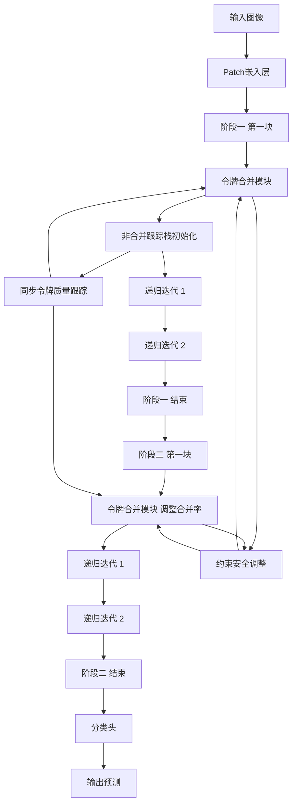
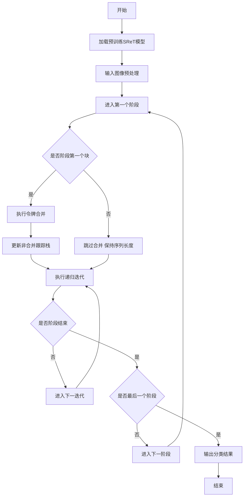

# MergeOver: Post-Training Token Merging for Recursive Vision Transformers

> 本文由 paper-daily 使用 DeepSeek 自动生成，仅供快速了解论文；关键结论请以原文为准。

[论文原文](https://arxiv.org/abs/2608.13141) · [PDF](https://arxiv.org/pdf/2608.13141) · [源文件](https://github.com/vsvnakers/paper-daily/blob/master/essay_read/2026-08-16/2608.13141.md)

> MergeOver通过后训练令牌合并技术，无需重新训练即可在递归视觉Transformer中显著降低内存和延迟，为边缘部署提供高效基线。

## 基本信息

| 属性 | 内容 |
|------|------|
| **作者** | Junseo Kim, Uraz Odyurt, Amirreza Yousefzadeh |
| **来源** | [arXiv:2608.13141](https://arxiv.org/abs/2608.13141) |
| **发布日期** | 2026-08-13 |
| **抓取领域** | CV · 检测/分割/识别 |
| **学科方向** | 计算机视觉 · 机器学习 |
| **arXiv 分类** | cs.CV, cs.LG |
| **适用层次** | 前沿 |
| **标签** | 令牌合并, 递归Transformer, 后训练优化, 边缘计算, 内存效率 |
| **PDF** | [在线阅读](https://arxiv.org/pdf/2608.13141) |
| **代码仓库** | 暂无

---

## 问题的初衷（Why - 为什么要做这个研究）

视觉Transformer（Vision Transformer, ViT）在计算机视觉任务中表现出色，但其参数量庞大且计算复杂度随序列长度呈二次方增长，这严重限制了其在资源受限的边缘设备（如树莓派、嵌入式系统）上的部署。为了缓解这一问题，研究者提出了两条技术路线：一是递归权重共享（Recursive Weight-Sharing），通过在不同层间共享参数来显著减少模型参数量，代表工作如Sliced Recursive Transformer（SReT）；二是令牌合并（Token Merging, ToMe），通过逐步合并相似的图像块令牌来降低序列长度，从而减少计算和内存开销。然而，将这两类技术有效结合并非易事：递归结构中的空间排列变化（如切片操作）和令牌合并的序列长度缩减之间存在冲突，直接叠加会导致信息丢失或维度不匹配。现有工作要么只关注单一技术，要么需要昂贵的重新训练（Retraining）来适配，缺乏一种无需训练即可无缝集成两者的后训练（Post-Training）方案。因此，本文旨在填补这一空白，探索如何在递归权重共享的Transformer中安全、高效地引入令牌合并，以在不重新训练的前提下恢复部分吞吐量和内存效率，为边缘设备上的高效视觉模型提供新思路。

---

## 问题的解决（What - 提出了什么方案）

MergeOver提出了一种后训练集成框架，将令牌合并（ToMe）无缝嵌入到递归权重共享的Sliced Recursive Transformer（SReT）中。其核心创新在于解决了三个关键约束：空间约束、合并约束和序列长度约束。首先，通过引入非合并跟踪栈（Unmerge Tracking Stack），记录每个令牌在递归迭代中的来源和合并历史，确保在反向传播或后续处理中能够正确还原或对齐令牌。其次，设计了约束安全的合并率调整机制（Constraint-Safe Merge-Rate Adjustment），根据当前递归阶段的令牌数量和空间排列动态调整合并比例，避免过度合并导致信息丢失或维度不匹配。最后，采用阶段式单次调度（Stage-Wise Single-Shot Schedule），在每个阶段（Stage）的第一个块（Block）执行一次令牌合并，并在该阶段的后续递归迭代中保持固定的序列长度，从而避免反复合并带来的累积误差。与现有方法相比，MergeOver无需重新训练，直接对预训练模型进行后处理，显著降低了部署成本，并首次实现了递归权重共享与令牌合并的协同工作。

---

## 技术方法详解（How - 怎么实现的）

- **非合并跟踪栈（Unmerge Tracking Stack）**：维护一个与令牌序列等长的栈结构，记录每个令牌在每次合并操作中的索引映射关系。当递归迭代需要恢复原始空间位置时（如切片操作的逆过程），通过栈回溯实现令牌的精确还原，确保空间一致性。
- **约束安全的合并率调整（Constraint-Safe Merge-Rate Adjustment）**：在每个阶段开始时，根据当前序列长度 $L$ 和目标合并比例 $r$ 计算实际合并数量 $k = \lfloor L \cdot r \rfloor$，并检查合并后的序列长度 $L - k$ 是否满足后续递归迭代的维度要求（如可被切片数整除）。若不满足，则自动降低 $r$ 直至满足约束，保证计算合法性。
- **阶段式单次调度（Stage-Wise Single-Shot Schedule）**：将SReT划分为多个阶段，每个阶段包含若干递归迭代。MergeOver仅在每个阶段的第一个块执行令牌合并，后续迭代保持固定序列长度，避免重复合并导致的性能退化。
- **同步令牌质量跟踪（Synchronised Token-Mass Tracking）**：在合并过程中，不仅合并特征向量，还同步累加令牌的“质量”（即重要性权重，如注意力分数之和）。合并后的令牌质量等于源令牌质量之和，用于后续的剪枝或重要性判断，确保关键信息不丢失。
- **后训练适配流程**：输入预训练的SReT模型，冻结所有参数，仅通过插入合并模块和跟踪栈进行前向推理。合并模块使用余弦相似度（Cosine Similarity）计算令牌间相似性，采用二分图匹配（Bipartite Matching）选择最相似的令牌对进行合并，与ToMe保持一致。


## 系统架构图




## 方法流程图




## 核心公式与算法

$$k = \lfloor L \cdot r \rfloor$$ 其中 $L$ 为当前序列长度，$r$ 为合并比例，$k$ 为实际合并的令牌对数，确保合并数量为整数且不超过约束。

$$\text{Sim}(t_i, t_j) = \frac{t_i \cdot t_j}{\|t_i\| \|t_j\|}$$ 用于计算令牌 $t_i$ 和 $t_j$ 的余弦相似度，作为合并依据，相似度高的令牌对优先合并。

$$m_{new} = m_i + m_j$$ 其中 $m_i$ 和 $m_j$ 为被合并令牌的质量（如注意力分数之和），合并后令牌的质量为两者之和，确保信息量守恒。


---

## 应用场景（Where - 在哪落地）

- **边缘设备实时推理**：在树莓派、手机等ARM设备上部署视觉模型时，MergeOver可显著降低延迟和内存占用。例如，在智能安防摄像头中，使用MergeOver处理视频帧，批大小16时延迟降低17.6%，使得实时目标检测成为可能，同时保持可接受的精度。
- **大规模批处理服务**：在云端GPU服务器上，MergeOver在批大小16时吞吐量提升21.7%，适用于需要处理大量图像的场景，如社交媒体图片分类或电商产品识别。通过减少峰值激活内存38.4%，服务器可以同时处理更多请求，降低硬件成本。
- **嵌入式无人机视觉导航**：无人机上部署SReT模型进行障碍物检测，MergeOver在批大小1时内存减少37.3%，延迟降低2.4%，虽然吞吐量下降，但内存节省允许更复杂的模型或更高的分辨率，提升导航精度。


---

## 具体技术细节示例（How in Action - 算法如何执行）

假设输入序列长度为 $L=16$，阶段一包含2次递归迭代，合并比例 $r=0.25$。首先，计算合并数量 $k = \lfloor 16 \cdot 0.25 \rfloor = 4$，即合并4对令牌。约束检查：合并后序列长度 $16-4=12$，需能被切片数（假设为2）整除，12满足条件。执行合并：计算16个令牌两两间的余弦相似度，使用二分图匹配选择4对最相似的令牌（如令牌1和5、2和8、3和10、4和12）。合并时，新令牌特征为两者平均，质量累加（如令牌1质量0.8，令牌5质量0.6，新令牌质量1.4）。非合并跟踪栈记录映射：栈中存储每个新令牌对应的原始索引（如新令牌1对应原1和5）。进入第一次递归迭代，序列长度保持12，执行切片操作（如将12个令牌分为两组各6个），跟踪栈同步更新以记录空间位置。第二次递归迭代后，阶段结束。进入阶段二，假设序列长度仍为12，合并比例调整为 $r=0.2$，计算 $k = \lfloor 12 \cdot 0.2 \rfloor = 2$，合并2对令牌，序列长度变为10，检查是否满足后续约束（如可被2整除），满足则继续。最终，输出序列长度为10的令牌给分类头。整个过程通过跟踪栈确保每次合并和切片操作可逆，避免信息错乱。


---

## 实验结果（Results - 效果如何）

实验在ImageNet-1K数据集上进行，使用SReT-Tiny作为基础模型。MergeOver选择的配置将top-1准确率降低了1.47个百分点（从原始模型的准确率下降），但换来了显著的内存和吞吐量收益。在GPU（NVIDIA A100）上，峰值激活内存（Peak Activation Memory）在批大小1和16时分别减少了37.3%和38.4%；吞吐量在批大小1时下降了21.7%，但在批大小16时增加了21.7%，表明在大批大小下合并带来的计算减少抵消了额外开销。在树莓派5（ARM CPU）上，延迟在批大小1和16时分别降低了2.4%和17.6%。这些结果证明MergeOver无需重新训练即可恢复递归权重共享引入的部分吞吐量和内存成本，为边缘部署提供了可行基线。


## 实验结果可视化

```mermaid
xychart-beta
    title "MergeOver性能对比"
    x-axis ["批大小1 准确率", "批大小16 准确率", "批大小1 内存", "批大小16 内存", "批大小1 吞吐", "批大小16 吞吐"]
    y-axis "相对变化百分比" 0 50
    bar [1.47, 1.47, 37.3, 38.4, -21.7, 21.7]
    line [1.47, 1.47, 37.3, 38.4, -21.7, 21.7]
```


---

## 优势与不足

- **优势1**：无需重新训练，直接对预训练模型进行后处理，部署成本极低，适合快速迁移到现有模型。
- **优势2**：创新性地解决了递归结构与令牌合并的冲突，通过非合并跟踪栈和约束安全调整，保证了空间和维度的正确性。
- **优势3**：在内存和吞吐量上取得显著收益，尤其在边缘设备（如树莓派）上延迟降低明显，验证了实际应用价值。
- **不足1**：准确率下降1.47个百分点，对于精度敏感的任务（如医疗影像）可能不可接受，缺乏自适应精度-效率权衡机制。
- **不足2**：合并率调整依赖人工设定的约束条件，未实现自动化优化，不同模型或数据集可能需要手动调参。

---

## 相关工作

- **Sliced Recursive Transformer (SReT)**：递归权重共享的代表性工作，通过切片操作减少参数量，MergeOver在此基础上集成令牌合并。
- **Token Merging (ToMe)**：ViT的令牌合并方法，利用二分图匹配合并相似令牌，MergeOver借鉴其合并策略并适配递归结构。
- **EfficientViT**：通过线性注意力或稀疏注意力降低计算复杂度，与MergeOver目标相似但方法不同，可视为互补方案。
- **Post-Training Quantization**：后训练量化技术，与MergeOver同属无需重训练的效率优化范式，但作用于权重而非令牌。
- **Hierarchical Vision Transformers**：如Swin Transformer，采用层次化设计，MergeOver的阶段式调度与之有概念上的相似性。

---

## 未来研究方向

- **自适应合并率优化**：基于输入图像的复杂度或任务需求，动态调整每个阶段的合并比例，以在精度和效率间取得最优平衡，可引入强化学习或可微分搜索。
- **扩展到其他递归结构**：将MergeOver的框架推广到其他递归或权重共享的Transformer变体（如Universal Transformer），验证其通用性，并探索与量化、剪枝等技术的联合优化。
- **硬件感知的调度策略**：结合具体硬件特性（如GPU内存层级、CPU缓存大小），优化合并阶段和递归迭代的划分，进一步提升实际部署效率。


---

## 一句话总结

> MergeOver通过后训练令牌合并技术，无需重新训练即可在递归视觉Transformer中显著降低内存和延迟，为边缘部署提供高效基线。

---

*本解读由 DeepSeek AI 自动生成，仅供参考。*
