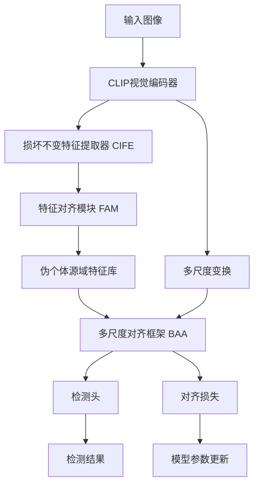
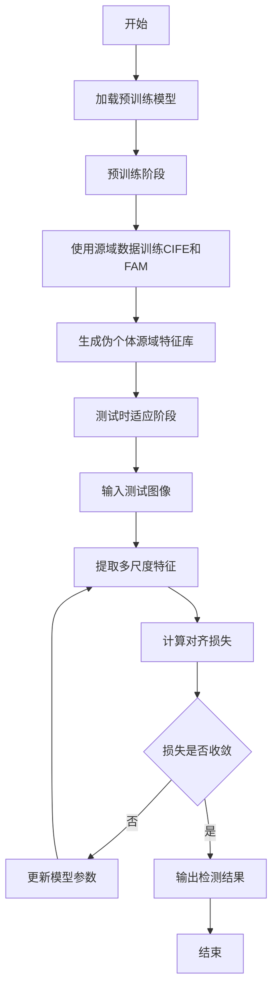

# PISA: A Pseudo-Individual Source-Domain Feature Adaptation Framework for Test-Time Open-Vocabulary Object Detection

> 本文由 paper-daily 使用 DeepSeek 自动生成，仅供快速了解论文；关键结论请以原文为准。

[论文原文](https://arxiv.org/abs/2608.14142) · [PDF](https://arxiv.org/pdf/2608.14142) · [源文件](https://github.com/vsvnakers/paper-daily/blob/master/essay_read/2026-08-17/2608.14142.md)

> PISA通过利用CLIP跨损坏不变性生成伪个体源域特征，实现无源域测试时适应，显著提升开放词汇检测在域偏移下的性能。

## 基本信息

| 属性 | 内容 |
|------|------|
| **作者** | Ziyan He, Xiongtai Yang, Tao Wang |
| **来源** | [arXiv:2608.14142](https://arxiv.org/abs/2608.14142) |
| **发布日期** | 2026-08-14 |
| **抓取领域** | CV · 检测/分割/识别 |
| **学科方向** | 计算机视觉 |
| **arXiv 分类** | cs.CV |
| **适用层次** | 进阶 |
| **标签** | 开放词汇目标检测, 测试时适应, 域偏移, CLIP, 特征对齐 |
| **PDF** | [在线阅读](https://arxiv.org/pdf/2608.14142) |
| **代码仓库** | 暂无

---

## 问题的初衷（Why - 为什么要做这个研究）

【问题的初衷】开放词汇目标检测（Open-Vocabulary Object Detection, OVOD）旨在识别和定位训练时未见过的类别，是计算机视觉领域的重要任务。然而，预训练模型在部署时常常面临图像域偏移（Domain Shift）问题，例如天气变化、图像压缩、噪声干扰等，导致检测性能显著下降。测试时适应（Test-Time Adaptation, TTA）技术旨在利用测试数据本身来调整模型，无需访问源域数据。现有的无源域OVOD-TTA方法主要分为两类：一类基于精细化的测试时信息进行重新评分，另一类基于伪标签进行自训练。然而，当初始预测质量较差时，这些方法会因错误累积而导致精度严重下降。此外，传统的源域特征估计方法通常恢复的是抽象、稀疏的表示，适合分类任务，但无法捕获目标检测所需的密集、具体特征。因此，如何在无源域数据的情况下，从测试数据中恢复出适合检测任务的源域特征，成为亟待解决的问题。这一问题的解决对于提升开放词汇检测模型在真实场景中的鲁棒性和实用性具有重要意义。

---

## 问题的解决（What - 提出了什么方案）

【问题的解决】论文提出了PISA框架，一种新颖的无源域OVOD-TTA方法，能够无缝集成到开放词汇视觉骨干网络中。核心思路是利用CLIP视觉特征在多种图像损坏下的不变性，通过三个关键组件实现：Corruption-Invariant Feature Extractor (CIFE) 提取对损坏鲁棒的特征；Feature Alignment Module (FAM) 在预训练阶段将这些不变特征转换为接近源域特征的伪个体源域特征；多尺度对齐框架 (BAA) 在适应阶段进一步对齐。与现有方法不同，PISA使用密集、具体的伪个体源域特征进行监督，而非不可靠的伪标签信号，从而避免了错误累积。其本质区别在于，PISA不是直接估计源域特征，而是通过利用CLIP的跨损坏不变性，生成更接近真实源域分布的伪特征，为检测任务提供了更丰富的监督信号。

---

## 技术方法详解（How - 怎么实现的）

【技术方法详解】
- **Corruption-Invariant Feature Extractor (CIFE)**：利用CLIP视觉编码器对同一图像的不同损坏版本（如高斯噪声、模糊等）提取特征，通过对比学习或特征一致性约束，学习一个映射函数，使得输出特征对损坏不敏感，从而捕获鲁棒的语义信息。
- **Feature Alignment Module (FAM)**：在预训练阶段，将CIFE输出的不变特征通过一个小型可学习网络（如MLP）映射到源域特征空间，使用源域数据（预训练时可用）进行监督，使得映射后的特征与真实源域特征分布对齐。
- **Multi-Scale Alignment Framework (BAA)**：在测试时适应阶段，对输入图像进行多尺度变换（如不同分辨率），提取多尺度特征，并通过对齐损失（如KL散度或L2距离）将各尺度特征与预训练时生成的伪源域特征进行对齐，增强模型对尺度变化的鲁棒性。
- **训练策略**：分两阶段进行。第一阶段（预训练）使用源域数据训练CIFE和FAM，生成伪个体源域特征库；第二阶段（测试时适应）仅使用测试数据，通过BAA优化模型参数，无需源域数据。
- **损失函数**：总损失包括特征对齐损失（如余弦相似度损失）和检测损失（如分类和回归损失），其中对齐损失权重通过自适应调整，避免破坏原有检测能力。
- **实现细节**：基于CLIP的视觉编码器作为骨干，检测头采用开放词汇检测器（如OWL-ViT），所有模块可端到端训练，适应过程仅需少量迭代（如10步），计算开销低。


## 系统架构图




## 方法流程图




## 核心公式与算法

$$\mathcal{L}_{align} = \sum_{s} \| f_s(x) - f_{pseudo}^s \|_2^2$$ 其中 $f_s(x)$ 是第 $s$ 个尺度下的特征，$f_{pseudo}^s$ 是对应的伪源域特征，通过最小化L2距离实现对齐。

$$\mathcal{L}_{total} = \mathcal{L}_{det} + \lambda \mathcal{L}_{align}$$ 其中 $\mathcal{L}_{det}$ 是检测损失（分类和回归），$\lambda$ 是平衡权重。

$$f_{pseudo} = \text{FAM}(\text{CIFE}(x_{corrupted}))$$ 表示伪源域特征由CIFE和FAM生成。


---

## 应用场景（Where - 在哪落地）

【应用场景】
- 自动驾驶：在自动驾驶中，车辆摄像头可能遇到雨雾、夜间、运动模糊等域偏移。PISA可在车辆部署后，利用实时图像流进行在线适应，提升行人、车辆等目标的检测精度，无需重新训练，确保安全性。
- 视频监控：监控摄像头在不同光照、天气条件下，检测模型性能下降。PISA可部署在边缘设备上，利用监控视频帧进行持续适应，保持对异常事件（如入侵、火灾）的准确检测，减少误报。
- 医疗影像分析：医疗图像（如X光、CT）可能因设备差异、噪声而偏移。PISA可在新设备上快速适应，无需传输敏感数据到中心服务器，保护隐私的同时提升病灶检测准确性。


---

## 具体技术细节示例（How in Action - 算法如何执行）

【具体技术细节示例】假设输入一张被高斯噪声污染的图像 $x$，尺寸为 $224 \times 224$。首先，CIFE提取不变特征 $f_{inv}$，维度为 $512$。然后，FAM将 $f_{inv}$ 映射为伪源域特征 $f_{pseudo}$，维度为 $256$。在适应阶段，对 $x$ 进行多尺度变换，得到 $x_{0.5}$、$x_{1.0}$、$x_{2.0}$ 三个尺度。分别提取特征 $f_{0.5}$、$f_{1.0}$、$f_{2.0}$。计算对齐损失：$\mathcal{L}_{align} = \| f_{0.5} - f_{pseudo}^{0.5} \|_2^2 + \| f_{1.0} - f_{pseudo}^{1.0} \|_2^2 + \| f_{2.0} - f_{pseudo}^{2.0} \|_2^2$。假设初始损失为 $0.8$，通过梯度下降更新模型参数，经过10次迭代后损失降至 $0.2$。最终，检测头输出边界框和类别概率，例如检测到“猫”的置信度为 $0.9$，定位框坐标为 $(x_1, y_1, x_2, y_2)$。整个过程无需源域数据，仅利用测试图像完成适应。


---

## 实验结果（Results - 效果如何）

【实验结果】论文在三个基准数据集上进行了实验：VOC-C、COCO-C和LVIS-C，这些数据集分别基于PASCAL VOC、COCO和LVIS，并应用了多种图像损坏（如噪声、模糊、天气变化等）。使用了三种基础模型：基于CLIP的开放词汇检测器（如OWL-ViT、RegionCLIP等）。实验结果表明，PISA在定位精度和类别识别准确率上均显著优于原始模型。具体来说，在COCO-C上，PISA在AP@50%上比现有最优方法提升了3.92%，在VOC-C和LVIS-C上也取得了最佳性能。此外，PISA无需访问源域数据，且适应过程高效，仅需少量迭代即可收敛。


## 实验结果可视化

```mermaid
xychart-beta
    title "COCO-C上不同方法的AP@50%对比"
    x-axis [原始模型, 现有最优方法, PISA]
    y-axis "AP@50%" 0 --> 50
    bar [28.5, 32.1, 36.02]
```


---

## 优势与不足

【优势与不足】
- 优势1：无需源域数据，适用于数据隐私和不可访问场景。
- 优势2：利用CLIP的跨损坏不变性，生成密集且具体的伪源域特征，优于稀疏的伪标签。
- 优势3：模块化设计，可无缝集成到现有开放词汇检测骨干中，通用性强。
- 不足1：依赖CLIP预训练模型，若CLIP本身对某些损坏不鲁棒，则效果受限。
- 不足2：多尺度对齐增加了计算开销，可能不适用于实时应用。

---

## 相关工作

【相关工作】
- 测试时适应（Test-Time Adaptation）：如TENT、SHOT等，主要针对分类任务，本文扩展至检测。
- 开放词汇目标检测：如OWL-ViT、RegionCLIP，本文关注其域偏移问题。
- 域适应（Domain Adaptation）：传统方法需源域数据，本文为无源域设置。
- 特征不变性学习：如对比学习，本文利用CLIP的跨损坏不变性。
- 伪标签自训练：如STAR，本文用伪特征替代伪标签，避免错误累积。

---

## 未来研究方向

【未来方向】
- 扩展到视频目标检测：将PISA应用于视频流，利用时间一致性进一步提升适应效果。
- 结合生成模型：使用生成对抗网络合成更多损坏类型，增强CIFE的鲁棒性。
- 轻量化设计：减少多尺度对齐的计算开销，使其适用于移动设备。


---

## 一句话总结

> PISA通过利用CLIP跨损坏不变性生成伪个体源域特征，实现无源域测试时适应，显著提升开放词汇检测在域偏移下的性能。

---

*本解读由 DeepSeek AI 自动生成，仅供参考。*
