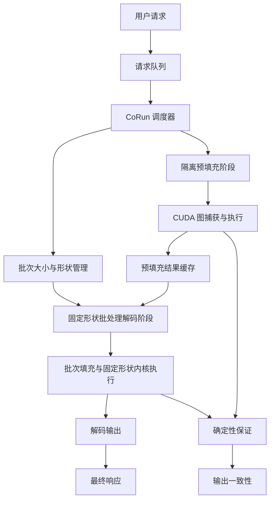
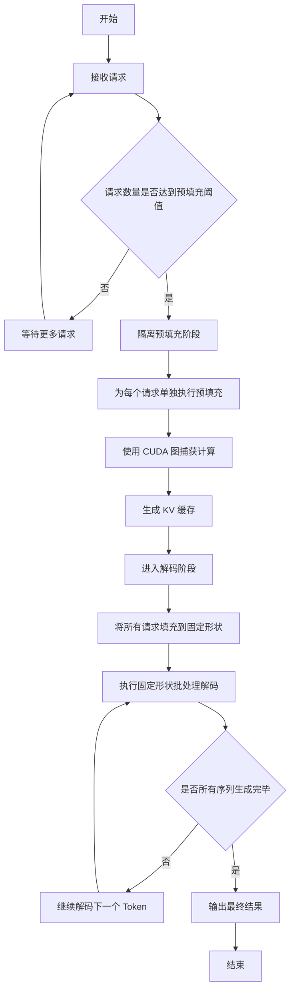
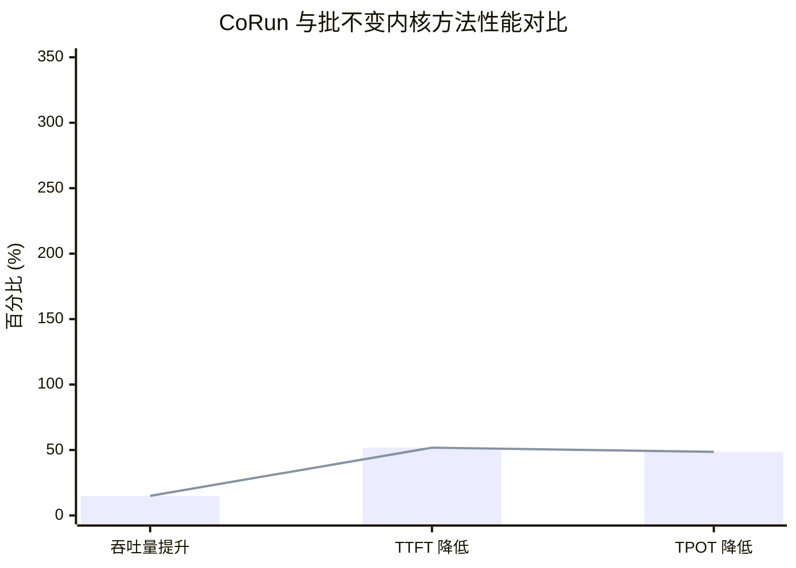

# CoRun: Padding is Simple and Efficient for Deterministic LLM Inference

> 本文由 paper-daily 使用 DeepSeek 自动生成，仅供快速了解论文；关键结论请以原文为准。

[论文原文](https://arxiv.org/abs/2608.14376) · [PDF](https://arxiv.org/pdf/2608.14376) · [源文件](https://github.com/vsvnakers/paper-daily/blob/master/essay_read/2026-08-17/2608.14376.md)

> CoRun 通过调度策略利用位置不变性，在不修改内核的情况下实现确定性 LLM 推理，同时大幅提升性能。

## 基本信息

| 属性 | 内容 |
|------|------|
| **作者** | Shiju Zhao, Jiacheng Yang, Qihang Chen, Junhao Hu, Jiaqi Zheng, Guihai Chen, Xusheng Chen |
| **来源** | [arXiv:2608.14376](https://arxiv.org/abs/2608.14376) |
| **发布日期** | 2026-08-14 |
| **抓取领域** | 体系结构/硬件加速 |
| **学科方向** | 操作系统 · 性能优化 |
| **arXiv 分类** | cs.OS, cs.PF |
| **适用层次** | 进阶 |
| **标签** | 确定性推理, 调度策略, CUDA图, 位置不变性, LLM推理优化 |
| **PDF** | [在线阅读](https://arxiv.org/pdf/2608.14376) |
| **代码仓库** | 暂无

---

## 问题的初衷（Why - 为什么要做这个研究）

【问题的初衷】随着大语言模型（Large Language Model, LLM）在模型评估、强化学习（Reinforcement Learning, RL）等下游任务中的广泛应用，推理（Inference）输出的确定性（Determinism）变得至关重要。然而，即使固定了采样参数和随机种子，LLM 推理仍然表现出输出不一致性。这种非确定性的主要来源是批处理相关的 GPU 执行方式：动态输入形状（Dynamic Input Shapes）会改变内核的平铺（Kernel Tiling）方式和浮点数归约（Floating-point Reduction）顺序，导致计算结果在不同批次大小或输入长度下产生微小但可观测的差异。现有系统通过设计批不变内核（Batch-invariant Kernels）来解决此问题，但这些内核限制了优化的平铺和分裂归约（Split Reductions），导致推理延迟增加超过 2 倍，服务吞吐量（Throughput）最高下降 74%。因此，如何在保证确定性的同时，不牺牲推理性能，成为一个亟待解决的重要问题。

---

## 问题的解决（What - 提出了什么方案）

【问题的解决】本文观察到，虽然大多数内核不具备批不变性（Batch-invariance），但它们具备位置不变性（Position-invariance），即对于输入序列中的相同位置，无论批次大小如何，其计算路径和归约顺序是确定的。基于这一关键洞察，论文提出了 CoRun，一个基于调度（Scheduling）的系统，它无需依赖批不变内核即可实现确定性推理。CoRun 将 LLM 推理的两个阶段——预填充（Prefill）和解码（Decode）——分别采用隔离预填充（Isolated Prefill）和固定形状批处理解码（Fixed-shape Batched Decode）策略。通过使用 CUDA 图（CUDA Graphs）来捕获和重放计算图，CoRun 既保证了执行的确定性，又简化了实现。其核心创新在于，通过调度策略而非修改内核来规避非确定性，从而保留了内核的优化性能，实现了确定性与高性能的兼得。

---

## 技术方法详解（How - 怎么实现的）

【技术方法详解】
- **位置不变性（Position-invariance）**：论文首先通过实验验证了大多数 LLM 推理内核（如矩阵乘法、注意力计算）在输入序列的相同位置上的计算是确定的，不受批次大小影响。这为调度策略提供了理论基础。
- **隔离预填充（Isolated Prefill）**：在预填充阶段，CoRun 将每个请求单独处理，即批次大小为 1。这样，每个请求的输入形状是固定的，避免了动态形状带来的非确定性。同时，利用 CUDA 图捕获预填充阶段的计算图，实现快速且确定性的执行。
- **固定形状批处理解码（Fixed-shape Batched Decode）**：在解码阶段，CoRun 将所有请求填充（Padding）到相同的序列长度，并采用固定的批次大小。这样，解码阶段的内核始终以相同的形状执行，保证了计算路径和归约顺序的一致性。
- **CUDA 图（CUDA Graphs）**：CoRun 利用 CUDA 图来捕获内核启动序列，减少 CPU 启动开销，并确保每次执行的计算图完全相同，从而消除因内核启动顺序变化带来的不确定性。
- **调度策略**：CoRun 的核心是一个调度器，它负责管理请求的到达、预填充和解码阶段的切换，以及批次大小的调整。调度器确保所有请求在预填充阶段被隔离处理，在解码阶段被组合成固定形状的批次。
- **实现简化**：由于不需要修改内核，CoRun 的实现相对简单，只需在系统层面进行调度和内存管理，降低了工程复杂度。

## 系统架构图

## 方法流程图

## 核心公式与算法

【核心公式】
- **位置不变性定义**：对于内核 $K$，输入序列 $X$ 和批次大小 $B$，如果对于任意位置 $i$，$K(X, B)[i] = K(X, 1)[i]$，则称 $K$ 具有位置不变性。
- **确定性条件**：CoRun 保证推理确定性的条件是：对于所有请求 $r$，其输出 $O_r$ 满足 $O_r = f_{\text{det}}(X_r)$，其中 $f_{\text{det}}$ 是确定性函数，且 $\text{Var}(O_r) = 0$。
- **性能提升量化**：CoRun 的吞吐量提升可以表示为 $\text{Speedup} = \frac{T_{\text{baseline}}}{T_{\text{CoRun}}}$，其中 $T_{\text{baseline}}$ 是批不变方法的平均处理时间，$T_{\text{CoRun}}$ 是 CoRun 的平均处理时间。

---

## 应用场景（Where - 在哪落地）

【应用场景】
- **模型评估与基准测试**：在 LLM 的离线评估中，需要确保多次运行产生相同的结果，以准确衡量模型性能。CoRun 可以保证评估过程的确定性，使得不同模型或不同版本的对比结果可靠且可复现。例如，在 Hugging Face 的 Open LLM Leaderboard 等基准测试中，使用 CoRun 可以消除因推理非确定性带来的评分波动。
- **强化学习训练**：在基于 LLM 的强化学习（如 RLHF）中，奖励模型（Reward Model）和策略模型（Policy Model）的推理输出需要稳定，以保证训练过程的收敛性。CoRun 可以确保每次采样生成的动作或响应是一致的，从而稳定训练信号，提高训练效率。例如，在训练一个对话智能体时，使用 CoRun 可以保证同一状态下的策略输出是确定的，避免因随机性导致的策略震荡。
- **金融与医疗等高风险领域**：在金融风控、医疗诊断等对可解释性和一致性要求极高的场景中，LLM 的推理结果必须可复现。CoRun 可以确保在相同输入下，系统始终给出相同的分析和建议，满足合规性和审计要求。例如，在医疗辅助诊断系统中，使用 CoRun 可以保证同一患者的病历数据在不同时间或不同系统上得到相同的诊断建议，增强医生和患者的信任。

---

## 具体技术细节示例（How in Action - 算法如何执行）

【具体技术细节示例】假设有两个请求 $R_1$ 和 $R_2$，它们的输入序列长度分别为 $L_1 = 10$ 和 $L_2 = 15$。在 CoRun 中，预填充阶段会分别处理这两个请求。
1. **预填充阶段**：
   - 请求 $R_1$ 被单独送入预填充内核，批次大小为 1，输入形状为 $[1, 10]$。使用 CUDA 图捕获该计算过程。
   - 请求 $R_2$ 同样被单独处理，输入形状为 $[1, 15]$。
   - 两个请求分别生成各自的 KV 缓存（Key-Value Cache），大小为 $[1, 10, d]$ 和 $[1, 15, d]$，其中 $d$ 是注意力维度。
2. **解码阶段**：
   - 调度器将 $R_1$ 和 $R_2$ 组合成一个批次，并将它们的序列长度都填充到最大长度 $L_{\max} = 15$。
   - 批次形状为 $[2, 15]$，其中 $R_1$ 的序列被填充了 5 个填充 Token（Padding Token）。
   - 解码内核以固定形状 $[2, 15]$ 执行，生成下一个 Token 的概率分布。
   - 对于 $R_1$，只取位置 10 处的输出作为有效 Token，忽略填充位置。
3. **迭代**：
   - 在后续解码步骤中，$R_1$ 的有效序列长度变为 11，$R_2$ 变为 16。调度器再次将它们填充到新的最大长度 $L_{\max} = 16$，批次形状变为 $[2, 16]$。
   - 这个过程持续进行，直到两个请求都生成结束标记（End-of-Sequence Token）。
4. **输出**：
   - 最终，$R_1$ 和 $R_2$ 分别得到完整的输出序列。由于每次解码的内核形状都是固定的，且预填充是隔离的，整个推理过程是确定性的。

---

## 实验结果（Results - 效果如何）

【实验结果】论文在多种架构的 LLM 上进行了实验，包括 Qwen 和 DeepSeek。实验结果表明，CoRun 在保证确定性的前提下，相比批不变内核方法，吞吐量提升了 15% 到 324%。具体而言，CoRun 将首 Token 延迟（Time-to-First-Token, TTFT）平均降低了 51.8%，将每 Token 输出时间（Time-per-Output-Token, TPOT）平均降低了 48.6%。这些数据充分证明了 CoRun 在消除非确定性的同时，显著提升了推理性能。

## 实验结果可视化

---

## 优势与不足

【优势与不足】
- **优势**
  - 创新性地提出位置不变性概念，为确定性推理提供了新的理论视角。
  - 无需修改内核，保留了内核的优化性能，实现了确定性与高性能的兼得。
  - 基于调度策略的实现相对简单，易于集成到现有推理系统中。
  - 实验覆盖多种 LLM 架构，结果具有广泛代表性。
- **不足**
  - 隔离预填充阶段可能导致 GPU 利用率不足，尤其是在请求较少时。
  - 固定形状批处理解码需要填充，可能引入一定的计算浪费。
  - 对于极端动态的负载，调度器的开销可能成为瓶颈。

---

## 相关工作

【相关工作】
- **批不变内核（Batch-invariant Kernels）**：现有系统通过设计批不变内核来保证确定性，但牺牲了性能。CoRun 与之形成对比，通过调度策略避免了对内核的修改。
- **CUDA 图（CUDA Graphs）**：CUDA 图被广泛用于减少内核启动开销和保证执行确定性。CoRun 利用 CUDA 图来捕获和重放计算图。
- **动态形状推理优化（Dynamic Shape Inference Optimization）**：许多工作致力于优化动态形状下的推理性能，但 CoRun 通过固定形状来规避非确定性。
- **LLM 推理服务系统（LLM Inference Serving Systems）**：如 vLLM、TensorRT-LLM 等，这些系统关注吞吐量和延迟优化，但未专门解决确定性问题。CoRun 可作为这些系统的补充。

---

## 未来研究方向

【未来方向】
- **动态批次调度优化**：进一步优化调度器，以支持更灵活的批次大小调整，在保证确定性的同时，提高 GPU 利用率。
- **跨设备确定性**：将 CoRun 扩展到多 GPU 或多节点环境，研究跨设备通信和同步对确定性的影响，实现分布式确定性推理。
- **与投机解码（Speculative Decoding）结合**：探索将 CoRun 的确定性保证与投机解码等加速技术结合，在保持确定性的同时进一步提升推理速度。

---

## 一句话总结

> CoRun 通过调度策略利用位置不变性，在不修改内核的情况下实现确定性 LLM 推理，同时大幅提升性能。

---

*本解读由 DeepSeek AI 自动生成，仅供参考。*
