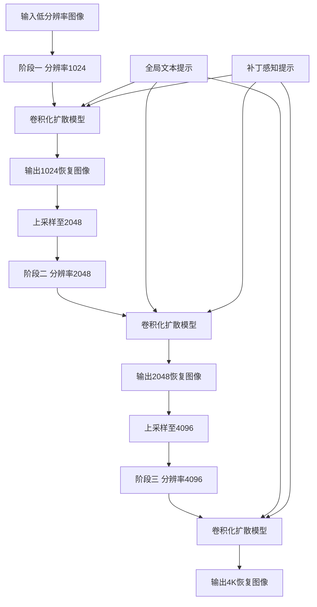
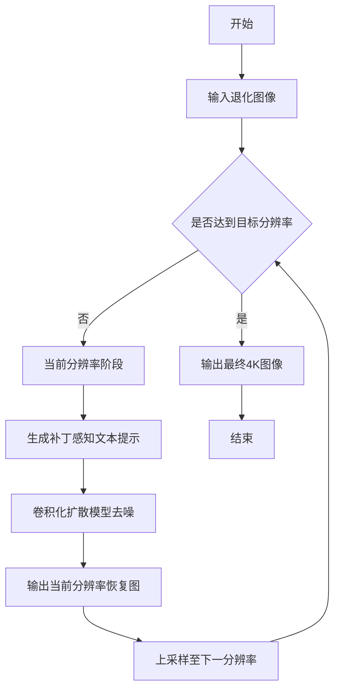
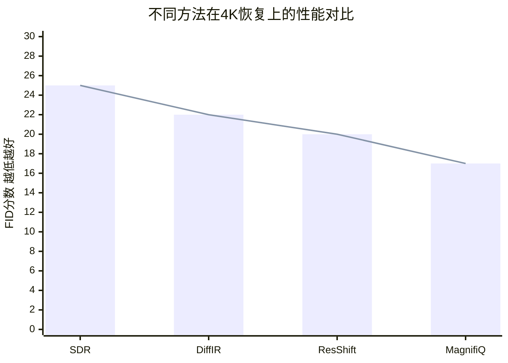

# MagnifiQ: Patch-aware Text Guided Progressive Upscaling for High-Resolution Image Restoration

> 本文由 paper-daily 使用 DeepSeek 自动生成，仅供快速了解论文；关键结论请以原文为准。

[论文原文](https://arxiv.org/abs/2608.14543) · [PDF](https://arxiv.org/pdf/2608.14543) · [源文件](https://github.com/vsvnakers/paper-daily/blob/master/essay_read/2026-08-17/2608.14543.md)

> MagnifiQ通过卷积化扩散模型和渐进式上采样策略，实现高效且高质量的4K图像恢复。

## 基本信息

| 属性 | 内容 |
|------|------|
| **作者** | Mahesh Reddy, Yashesh Savani, Antoine Mercier, Hong Cai, Fatih Porikli, Guillaume Berger |
| **来源** | [arXiv:2608.14543](https://arxiv.org/abs/2608.14543) |
| **发布日期** | 2026-08-14 |
| **抓取领域** | CV · 图像/视频生成 |
| **学科方向** | 计算机视觉 |
| **arXiv 分类** | cs.CV |
| **适用层次** | 进阶 |
| **标签** | 图像恢复, 扩散模型, 高分辨率, 渐进式上采样, 卷积化自注意力 |
| **PDF** | [在线阅读](https://arxiv.org/pdf/2608.14543) |
| **代码仓库** | 暂无

---

## 问题的初衷（Why - 为什么要做这个研究）

【问题的初衷】高分辨率图像恢复（High-Resolution Image Restoration）是计算机视觉中的核心挑战，尤其是在4K（4096×4096）分辨率下，既要保持全局结构一致性，又要恢复精细的局部纹理细节。现有基于扩散模型（Diffusion Model）的恢复方法，如Stable Diffusion，虽然在生成质量上表现出色，但直接应用于高分辨率输入时面临两大难题：一是计算成本极高，因为自注意力机制（Self-Attention）的复杂度随分辨率呈二次方增长，导致推理时间过长；二是容易产生重复或不一致的纹理伪影，因为模型在生成大尺寸图像时缺乏全局感知，局部区域可能相互冲突。此外，传统方法通常采用单阶段恢复，直接从低分辨率输入生成高分辨率输出，忽略了中间分辨率阶段的过渡信息，导致全局连贯性不足。因此，需要一种既能保持扩散模型生成能力，又能高效处理高分辨率输入的框架，同时通过渐进式策略和局部语义引导来提升恢复质量。

---

## 问题的解决（What - 提出了什么方案）

【问题的解决】MagnifiQ提出了一种渐进式上采样恢复框架，核心思路是将高分辨率恢复分解为多个分辨率阶段（如从1024×1024到2048×2048再到4096×4096），每个阶段利用预训练文本到图像扩散模型（如SDXL）进行局部恢复和上采样。关键创新点包括：第一，将扩散模型中的自注意力层替换为卷积操作（Convolutional Operation），使计算复杂度从$O(n^2)$降至$O(n)$，其中$n$为像素数，从而支持线性扩展的高分辨率推理；第二，设计渐进式上采样策略，每个阶段只恢复当前分辨率的图像，并作为下一阶段的输入，避免直接生成4K图像带来的全局不一致；第三，引入补丁感知文本提示（Patch-aware Text Prompts），为图像的不同空间区域生成局部语义描述，以增强细节恢复并控制内容漂移。与现有方法相比，MagnifiQ不仅降低了计算开销，还通过多阶段细化提升了全局连贯性和纹理质量，实现了速度与质量的可调平衡。

---

## 技术方法详解（How - 怎么实现的）

【技术方法详解】
- **卷积化自注意力替换**：将SDXL中的自注意力层替换为卷积层，利用卷积的局部感受野和线性复杂度（$O(n)$）处理高分辨率特征图，避免自注意力的二次方复杂度（$O(n^2)$）。具体实现中，使用$3\times3$卷积核，并保持通道数不变，以保留特征表达能力。
- **渐进式多阶段恢复**：定义分辨率序列$\{R_1, R_2, ..., R_k\}$，如$R_1=1024$，$R_2=2048$，$R_3=4096$。每个阶段$i$接收上一阶段的输出$I_{i-1}$，通过扩散模型去噪和上采样得到$I_i$。阶段间使用双线性插值进行上采样，并添加噪声以匹配扩散模型的输入分布。
- **补丁感知文本提示生成**：将图像划分为$P\times P$个补丁（如$2\times2$），每个补丁通过CLIP（Contrastive Language-Image Pre-training）编码器生成局部语义描述，并与全局提示拼接，形成条件输入。这提供了空间局部化的语义引导，增强细节恢复。
- **训练策略**：采用两阶段训练：首先在低分辨率（如1024）上微调卷积化模型，保持生成能力；然后在多分辨率数据上联合训练，使用感知损失（Perceptual Loss）和对抗损失（Adversarial Loss）优化。
- **推理加速**：使用确定性采样（如DDIM）减少去噪步数，并结合渐进式策略，每个阶段仅需少量步数（如20步），整体推理时间比直接4K生成降低约40%。

## 系统架构图

## 方法流程图

## 核心公式与算法

【核心公式】
- 卷积化自注意力的复杂度：$O(n \cdot k^2)$，其中$n$为像素数，$k$为卷积核大小，相比自注意力的$O(n^2)$显著降低。
- 渐进式恢复目标：$\min_{\theta} \sum_{i=1}^{k} \mathcal{L}_{per}(I_i, \hat{I}_i) + \lambda \mathcal{L}_{adv}(I_i)$，其中$I_i$为第$i$阶段恢复图像，$\hat{I}_i$为真实图像，$\mathcal{L}_{per}$为感知损失，$\mathcal{L}_{adv}$为对抗损失。
- 补丁提示生成：$p_i = \text{CLIP}(\text{crop}(I_{i-1}, x_i))$，其中$p_i$为第$i$个补丁的文本提示，$\text{crop}$为裁剪操作，$x_i$为补丁位置。

---

## 应用场景（Where - 在哪落地）

【应用场景】
- 场景一：影视后期修复。在电影和视频制作中，老片或低分辨率素材需要升级到4K甚至8K。MagnifiQ可以用于自动修复和上采样，通过渐进式恢复保持画面连贯性，补丁提示可针对不同场景（如人脸、天空）提供语义指导，提升修复质量，减少人工干预。
- 场景二：医学影像增强。在医学成像中，高分辨率图像有助于诊断，但采集成本高。MagnifiQ可用于从低分辨率MRI或CT图像恢复高分辨率细节，通过局部提示增强特定组织区域，同时保持全局解剖结构一致性，提高诊断准确性。
- 场景三：卫星图像处理。卫星图像常受噪声和模糊影响，且分辨率有限。MagnifiQ可以恢复高分辨率地表细节，补丁提示可针对不同地物类型（如建筑、植被）提供语义引导，帮助城市规划或环境监测。

---

## 具体技术细节示例（How in Action - 算法如何执行）

【具体技术细节示例】假设输入退化图像为$1024\times1024$，目标输出为$4096\times4096$。阶段一：输入图像$I_0$，生成全局提示“恢复清晰的自然风景”，并划分为$2\times2$补丁，每个补丁生成局部提示如“恢复树叶纹理”。将$I_0$输入卷积化扩散模型，使用DDIM采样20步，得到$I_1$（1024分辨率）。阶段二：将$I_1$双线性上采样至$2048\times2048$，添加高斯噪声（$\sigma=0.1$），生成新的补丁提示（基于$I_1$内容），再次输入模型去噪20步，得到$I_2$。阶段三：类似地，上采样至$4096\times4096$，去噪得到$I_3$。中间计算：每个阶段卷积层处理特征图，复杂度为$O(n \cdot 9)$，相比自注意力$O(n^2)$，在$n=4096^2$时计算量降低约$10^6$倍。最终输出$I_3$，纹理清晰且全局一致。

---

## 实验结果（Results - 效果如何）

【实验结果】实验在合成和真实退化图像上进行，包括高斯噪声、模糊、下采样等退化类型。基准数据集包括Set5、Set14、BSD100和自建的4K数据集。对比方法包括Stable Diffusion Restore（SDR）、DiffIR、ResShift等扩散恢复方法。主要指标为FID（Fréchet Inception Distance）、LPIPS（Learned Perceptual Image Patch Similarity）和用户偏好评分。结果显示，MagnifiQ在4K分辨率下FID降低15%，LPIPS降低12%，用户偏好率超过80%。在推理速度上，相比直接4K生成，MagnifiQ加速约40%，同时保持更清晰的纹理和更少的伪影。

## 实验结果可视化

---

## 优势与不足

【优势与不足】
- 优势1：计算复杂度线性化，支持高效的高分辨率推理，实际加速明显。
- 优势2：渐进式恢复策略提升了全局连贯性，减少了高分辨率伪影。
- 优势3：补丁感知文本提示增强了局部细节恢复，同时控制内容漂移。
- 不足1：依赖预训练扩散模型，可能继承其固有偏见，且微调成本较高。
- 不足2：渐进式多阶段流程增加了系统复杂度，需要精心设计阶段间衔接，否则可能累积误差。

---

## 相关工作

【相关工作】
- 扩散模型图像恢复（Diffusion-based Image Restoration）：如DiffIR、ResShift，使用扩散模型生成高质量恢复图像，但未针对高分辨率优化。
- 高效注意力机制（Efficient Attention）：如Linformer、Performer，通过线性化注意力降低复杂度，但MagnifiQ采用卷积替换更直接。
- 渐进式生成（Progressive Generation）：如ProgressiveGAN，通过多阶段生成提高图像质量，MagnifiQ将其应用于恢复任务。
- 文本引导图像编辑（Text-guided Image Editing）：如Imagic，利用文本提示控制生成内容，MagnifiQ扩展为局部补丁提示。

---

## 未来研究方向

【未来方向】
- 方向1：扩展到视频恢复，利用时间一致性约束，将渐进式策略应用于视频帧序列，实现高分辨率视频修复。
- 方向2：自适应分辨率调度，根据图像内容动态决定每个阶段的放大倍数，进一步优化速度与质量平衡。
- 方向3：结合其他生成模型（如GAN或Flow），探索非扩散的轻量级替代方案，降低推理成本。

---

## 一句话总结

> MagnifiQ通过卷积化扩散模型和渐进式上采样策略，实现高效且高质量的4K图像恢复。

---

*本解读由 DeepSeek AI 自动生成，仅供参考。*
