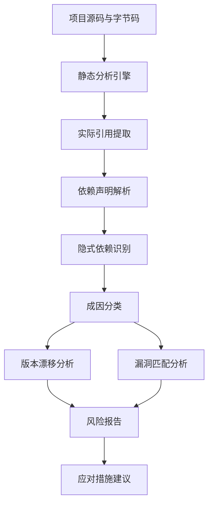
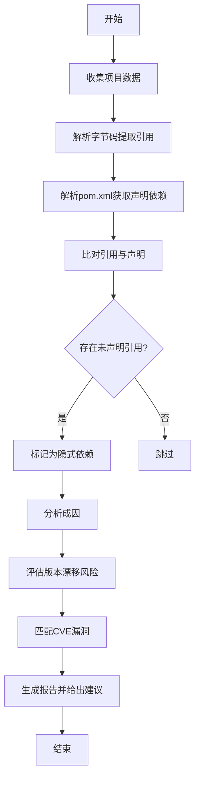
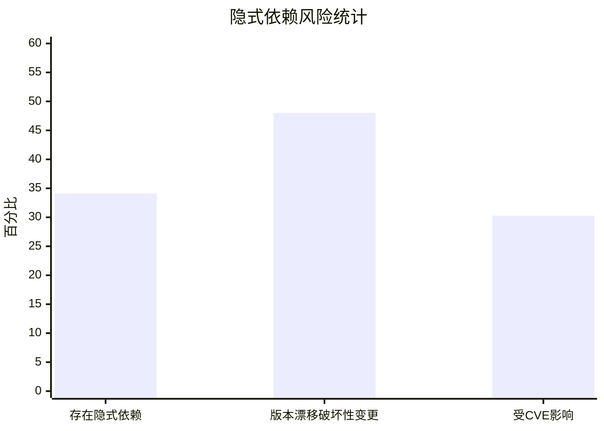

# Implicit, Yet Impactful: Understanding Hidden Dependencies in Java Projects

> 本文由 paper-daily 使用 DeepSeek 自动生成，仅供快速了解论文；关键结论请以原文为准。

[论文原文](https://arxiv.org/abs/2608.16262) · [PDF](https://arxiv.org/pdf/2608.16262) · [源文件](https://github.com/vsvnakers/paper-daily/blob/master/essay_read/2026-08-18/2608.16262.md)

> 本文首次系统研究Java项目中隐式依赖的普遍性、风险与应对措施，为依赖管理提供新视角。

## 基本信息

| 属性 | 内容 |
|------|------|
| **作者** | Lyuye Zhang, Chengwei Liu, Fangyuan Zhang, Yiran Zhang, Yuan Zhou, Yang Liu |
| **来源** | [arXiv:2608.16262](https://arxiv.org/abs/2608.16262) |
| **发布日期** | 2026-08-17 |
| **抓取领域** | 注意力机制 · 稀疏/高效Attention |
| **学科方向** | 软件工程 |
| **arXiv 分类** | cs.SE |
| **适用层次** | 进阶 |
| **标签** | 隐式依赖, Maven生态, 依赖管理, 软件供应链安全, 静态分析 |
| **PDF** | [在线阅读](https://arxiv.org/pdf/2608.16262) |
| **代码仓库** | 暂无

---

## 问题的初衷（Why - 为什么要做这个研究）

【问题的初衷】随着软件生态系统的快速发展，包管理器（如 Maven）通过自动解析依赖关系来构建依赖图，用户只需在配置文件中声明直接依赖（Direct Dependencies）。然而，在实际开发中，开发者可能由于疏忽或对依赖传递机制理解不足，在代码中直接使用了未在配置文件中声明的类或方法，这些依赖被称为隐式依赖（Implicit Dependencies）。与普通的传递依赖（Transitive Dependencies）不同，隐式依赖虽然被直接使用，却未在项目配置中显式声明，导致其版本不受项目直接控制。这种“隐性”问题带来了严重的安全和维护风险：一方面，隐式依赖的版本漂移可能导致破坏性变更（Breaking Changes），影响项目稳定性；另一方面，隐式依赖中的已知漏洞（CVE）可能被直接调用，造成安全威胁。然而，现有研究主要关注显式依赖和传递依赖的治理，对隐式依赖的系统性研究几乎空白。因此，本文首次以隐式依赖为核心研究对象，旨在量化其在 Maven 生态系统中的生命周期影响，揭示其成因、风险及应对措施，填补了这一研究空白。

---

## 问题的解决（What - 提出了什么方案）

【问题的解决】本文提出了一种系统性的方法来识别和分析 Java 项目中的隐式依赖。首先，作者构建了一个大规模数据集，包含来自 Maven Central Repository 的 1,157 个库（共 19,812 个版本）和来自 GitHub 的 972 个模块。通过静态分析技术，解析项目字节码和源码，提取实际引用的类和方法，并与声明的依赖进行比对，从而识别出隐式依赖。其次，作者对隐式依赖的成因进行了分类，发现两种主要原因：一是开发者直接使用了传递依赖中的类而未显式声明；二是由于依赖冲突或版本覆盖导致实际生效的依赖与声明不符。进一步，作者量化了隐式依赖带来的风险，包括版本漂移导致的破坏性变更（48% 的隐式依赖受影响）和已知漏洞（36 个 CVE 的漏洞方法被直接使用）。最后，作者总结并分析了四种主要应对措施，包括依赖声明补全、依赖锁定、依赖分析工具集成和社区规范制定，为开源软件（OSS）生态系统的利益相关者提供了可操作的见解。

---

## 技术方法详解（How - 怎么实现的）

【技术方法详解】
- **数据集构建**：从 Maven Central Repository 选取 1,157 个库的 19,812 个版本，并从 GitHub 选取 972 个 Java 模块，确保覆盖广泛的应用场景和版本历史。
- **隐式依赖识别**：使用字节码分析工具（如 ASM）解析编译后的 class 文件，提取所有被引用的外部类和方法；同时解析项目的 pom.xml 文件获取声明的直接依赖和传递依赖；通过比对实际引用与声明依赖，识别出未被声明的直接引用，即为隐式依赖。
- **成因分析**：对识别出的隐式依赖进行根因分析，发现两种主要成因：一是开发者直接使用了传递依赖中的类（未显式声明），二是依赖冲突导致 Maven 的“最近优先”策略覆盖了声明版本，使得实际生效的依赖与预期不符。
- **风险量化**：通过版本漂移分析，检查隐式依赖的版本是否与项目直接声明的版本一致，若不一致则评估破坏性变更的可能性；同时，利用 CVE 数据库匹配隐式依赖的版本，检查是否存在已知漏洞，并进一步分析漏洞方法是否被项目直接调用。
- **应对措施评估**：总结并评估四种主要应对措施，包括：1）在代码审查中强制检查隐式依赖；2）使用依赖锁定工具（如 Maven Enforcer）确保版本一致性；3）集成静态分析工具（如 OWASP Dependency-Check）自动检测隐式依赖漏洞；4）推动社区规范，鼓励开发者显式声明所有直接使用的依赖。

## 系统架构图

## 方法流程图

## 核心公式与算法

【核心公式】
本文主要采用实证分析方法，没有提出新的数学公式。但可以定义隐式依赖的识别逻辑：
设 $D_{declared}$ 为项目声明的直接依赖集合，$D_{transitive}$ 为传递依赖集合，$R_{code}$ 为代码中实际引用的外部依赖集合，则隐式依赖 $D_{implicit}$ 可表示为：
$$D_{implicit} = R_{code} \setminus (D_{declared} \cup D_{transitive})$$
其中 $\setminus$ 表示集合差。此外，版本漂移风险可量化为：
$$Risk_{drift} = \frac{\sum_{d \in D_{implicit}} \mathbb{I}(v_d \neq v_{declared})}{|D_{implicit}|}$$
其中 $v_d$ 为实际生效版本，$v_{declared}$ 为声明版本，$\mathbb{I}$ 为指示函数。

---

## 应用场景（Where - 在哪落地）

【应用场景】
1. **企业级 Java 项目维护**：在大型企业级 Java 项目中，开发者经常使用 Spring Boot 等框架，这些框架会引入大量传递依赖。通过应用本文的隐式依赖识别方法，企业可以自动扫描项目代码，发现未声明的直接依赖，并在 CI/CD 流程中集成检查，确保所有直接使用的依赖都被显式声明，从而避免因版本漂移导致的构建失败和运行时异常，提升项目的可维护性和稳定性。
2. **开源软件安全审计**：开源项目维护者可以使用本文的方法对项目进行安全审计，识别隐式依赖中存在的已知漏洞（CVE），并优先修复被直接调用的漏洞方法。例如，某项目隐式依赖了 Log4j 的旧版本，且直接调用了存在漏洞的类，通过本文方法可以快速定位并升级依赖，降低安全风险。
3. **依赖管理工具优化**：包管理器（如 Maven）和依赖分析工具（如 Dependabot）可以借鉴本文的研究成果，增强对隐式依赖的检测和提示功能。例如，在依赖解析时，工具可以自动比对代码引用与声明，向开发者发出警告，并提供一键补全声明的建议，从而提升整个生态系统的依赖健康度。

---

## 具体技术细节示例（How in Action - 算法如何执行）

【具体技术细节示例】
假设有一个 Java 项目 `my-app`，其 `pom.xml` 中声明了直接依赖 `com.example:library-a:1.0.0`，而 `library-a` 传递依赖了 `com.example:library-b:2.0.0`。在项目代码中，开发者直接使用了 `library-b` 中的类 `com.example.libraryb.Utils`，但未在 `pom.xml` 中声明 `library-b`。

**步骤1：解析字节码**
使用 ASM 解析 `my-app` 的编译产物（class 文件），提取所有外部类引用，得到集合 $R_{code} = \{com.example.librarya.ClassA, com.example.libraryb.Utils\}$。

**步骤2：解析声明依赖**
解析 `pom.xml`，得到直接依赖集合 $D_{declared} = \{com.example:library-a:1.0.0\}$，并通过 Maven 依赖树获取传递依赖集合 $D_{transitive} = \{com.example:library-b:2.0.0\}$。

**步骤3：识别隐式依赖**
计算 $D_{implicit} = R_{code} \setminus (D_{declared} \cup D_{transitive})$。由于 `com.example.libraryb.Utils` 在 $R_{code}$ 中，且不在 $D_{declared}$ 中，但它在 $D_{transitive}$ 中，因此按照定义，它不属于隐式依赖？实际上，本文的定义是“未声明但直接使用”，而传递依赖是声明的间接结果，因此这里需要更精确：隐式依赖是指未在直接依赖中声明，但代码直接引用的依赖，无论它是否在传递依赖中。因此，`library-b` 是隐式依赖，因为它被直接使用但未在 `pom.xml` 中直接声明。

**步骤4：风险分析**
假设 `library-b` 的版本 2.0.0 存在一个已知 CVE，且 `Utils` 类中的某个方法正是漏洞方法。本文的方法会标记该隐式依赖为高风险，并建议开发者显式声明 `library-b` 并升级到安全版本。

**输出**：最终报告显示项目存在隐式依赖 `com.example:library-b:2.0.0`，风险等级为高，建议在 `pom.xml` 中添加声明并升级版本。

---

## 实验结果（Results - 效果如何）

【实验结果】本文在构建的大规模数据集上进行了实验，结果显示：34.12% 的分析样本中存在隐式依赖，表明该问题在 Maven 生态系统中相当普遍。在成因分析中，两种主要原因被识别，其中一种与传递依赖的直接使用相关，另一种与依赖冲突相关。在风险方面，48% 的隐式依赖因版本漂移引入了破坏性变更，导致项目编译失败或运行时错误；此外，36 个 CVE 的漏洞方法被根项目直接使用，且 30.28% 的隐式依赖在版本范围约定下受到已知漏洞影响。这些数据凸显了隐式依赖对项目安全和维护的严重威胁。

## 实验结果可视化

---

## 优势与不足

【优势与不足】
- 优势1：首次系统性地研究隐式依赖问题，填补了研究空白，具有开创性。
- 优势2：构建了大规模数据集，覆盖多个库和版本，实验结果具有统计显著性。
- 优势3：提供了可操作的应对措施，对开发者和社区具有实际指导意义。
- 不足1：静态分析可能无法完全捕捉动态加载或反射调用，导致隐式依赖识别存在遗漏。
- 不足2：数据集主要来自 Maven 生态，结论可能不适用于其他包管理器（如 npm、PyPI）。

---

## 相关工作

【相关工作】
- 依赖管理研究：如 Dependabot 和 Renovate 等工具，关注显式依赖的更新和漏洞修复，但未考虑隐式依赖。
- 传递依赖分析：如 TPL 分析，研究传递依赖的冗余和风险，但未聚焦于被直接使用的未声明依赖。
- 漏洞检测：如 OWASP Dependency-Check，基于声明的依赖进行漏洞扫描，对隐式依赖失效。
- 软件供应链安全：研究依赖混淆和恶意包，但未深入隐式依赖的版本控制问题。

---

## 未来研究方向

【未来方向】
1. **跨生态系统的隐式依赖研究**：将本文的方法扩展到 npm、PyPI 等其他包管理器，比较不同生态系统中隐式依赖的普遍性和风险差异。
2. **动态分析补充**：结合运行时监控（如 Java Agent）来捕捉反射和动态加载导致的隐式依赖，提高识别准确性。
3. **自动化修复工具**：开发智能工具，能够自动为项目补全隐式依赖声明，并推荐安全版本，减少人工干预。

---

## 一句话总结

> 本文首次系统研究Java项目中隐式依赖的普遍性、风险与应对措施，为依赖管理提供新视角。

---

*本解读由 DeepSeek AI 自动生成，仅供参考。*
