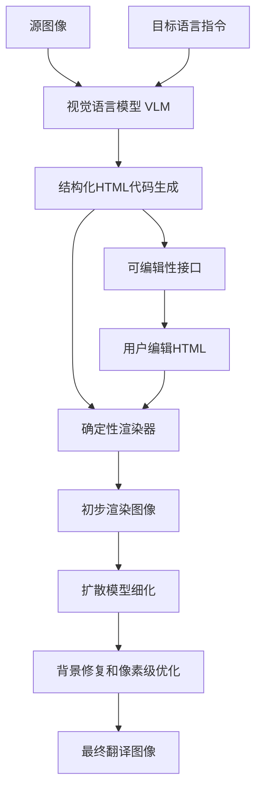
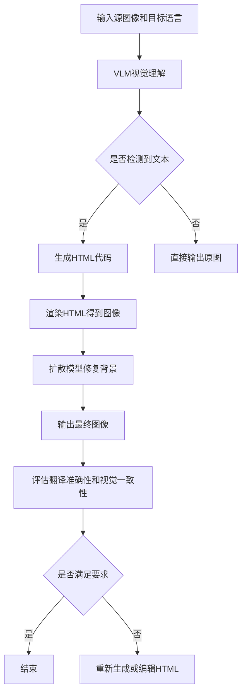

# TransAnyText: Translating Arbitrary Text in E-commerce Images via Structured Visual Generation

> 本文由 paper-daily 使用 DeepSeek 自动生成，仅供快速了解论文；关键结论请以原文为准。

[论文原文](https://arxiv.org/abs/2608.16284) · [PDF](https://arxiv.org/pdf/2608.16284) · [源文件](https://github.com/vsvnakers/paper-daily/blob/master/essay_read/2026-08-18/2608.16284.md)

> TransAnyText通过结构化视觉代码框架，将图像文本翻译转化为HTML生成，实现了高准确性、视觉一致性和可编辑性的统一。

## 基本信息

| 属性 | 内容 |
|------|------|
| **作者** | Xiaoan Liu, Lichen Ma, Zipeng Guo, Yu He, Xiaoyan Su, Shaojie Guo, Hao Yang, Jingling Fu, Xiaolong Fu, Zhen Chen, Yu Guo, Fei Wang, Xinyi Liu, Yongjun Zhang, Ke Zhang, Junshi Huang |
| **来源** | [arXiv:2608.16284](https://arxiv.org/abs/2608.16284) |
| **发布日期** | 2026-08-17 |
| **抓取领域** | CV · 图像/视频生成 |
| **学科方向** | 计算机视觉 |
| **arXiv 分类** | cs.CV |
| **适用层次** | 进阶 |
| **标签** | 图像文本翻译, 结构化视觉生成, 视觉语言模型, 扩散模型, 强化学习 |
| **PDF** | [在线阅读](https://arxiv.org/pdf/2608.16284) |
| **代码仓库** | 暂无

---

## 问题的初衷（Why - 为什么要做这个研究）

【问题的初衷】跨境电子商务的蓬勃发展使得商品图片的多语言翻译成为一项关键需求。商家需要将产品图片、横幅广告和详情页中的文字翻译成目标语言，以触达全球消费者。然而，现有的图像文本翻译方法面临三大核心挑战：一是翻译准确性不足，尤其是对艺术字体、复杂排版和长文本的处理；二是难以保持视觉身份的一致性，即翻译后的图像需要保留原始图像的风格、布局和设计元素；三是输出结果难以编辑，商家往往需要微调翻译后的文本或样式，但现有方法生成的图像是像素级的，无法进行灵活的后期修改。传统级联方法（如OCR-翻译-渲染）虽然可编辑，但错误会逐级累积，且对复杂背景和字体样式处理不佳。端到端生成模型（如基于扩散模型的方法）虽然能生成较自然的图像，但缺乏可编辑性，且难以精确控制文本内容。因此，亟需一种既能保证翻译准确、又能保持视觉一致性、同时支持灵活编辑的图像文本翻译方法。

---

## 问题的解决（What - 提出了什么方案）

【问题的解决】TransAnyText提出了一种结构化视觉代码框架，将图像文本翻译问题重新定义为从源图像和目标语言生成可渲染的HTML补丁。这一框架的核心创新在于将语义生成与像素渲染解耦：视觉语言模型（VLM）负责视觉理解、跨语言翻译和结构化视觉生成，输出HTML代码；扩散模型负责背景修复和像素级细化；最后通过确定性渲染合成最终图像。这种设计使得翻译过程既具备端到端学习的灵活性，又保留了级联方法的可编辑性。与现有方法相比，TransAnyText的本质区别在于：它将翻译任务转化为代码生成任务，利用HTML的结构化特性来精确控制文本内容、样式和布局，同时通过扩散模型处理背景和细节，实现了翻译准确性、视觉一致性和可编辑性的统一。此外，论文还提出了三阶段后训练框架，包括监督微调（SFT）、特权差距加权自蒸馏（PWSD）和带可验证奖励的强化学习（RLVR），以逐步提升模型的性能。

---

## 技术方法详解（How - 怎么实现的）

【技术方法详解】
- **结构化视觉代码框架**：TransAnyText将图像文本翻译定义为生成HTML补丁的任务。给定源图像 $I_{src}$ 和目标语言 $L_{tgt}$，模型输出一个HTML代码片段 $H$，该代码片段描述了图像中所有文本元素的内容、样式和位置。
- **视觉语言模型（VLM）**：使用预训练的VLM（如基于Qwen-VL的架构）作为主干，输入图像和语言指令，输出结构化的HTML代码。VLM负责视觉理解（识别文本区域和样式）、跨语言翻译（将源语言文本翻译为目标语言）和结构化生成（生成符合HTML语法的代码）。
- **扩散模型细化**：生成的HTML代码通过确定性渲染得到初步图像，但背景和细节可能不完美。因此，使用一个扩散模型（如Stable Diffusion）对渲染图像进行背景修复和像素级细化，确保图像的自然度和一致性。
- **三阶段后训练**：
  1. **监督微调（SFT）**：在包含图像-HTML对的数据集上进行微调，建立图像到代码的映射能力。损失函数为交叉熵损失，优化HTML token的预测概率。
  2. **特权差距加权自蒸馏（PWSD）**：为了改善样式和布局token的学习，引入特权信息（如真实布局框）作为辅助信号，通过自蒸馏方式加权训练，使模型更关注难以学习的token。
  3. **强化学习（RLVR）**：使用可验证的奖励（如文本翻译准确率、布局重叠度）进行强化学习，优化任务级性能。奖励函数定义为 $R = \lambda_1 \cdot \text{Acc}_{text} + \lambda_2 \cdot \text{IoU}_{layout} + \lambda_3 \cdot \text{Style}_{sim}$，其中 $\text{Acc}_{text}$ 是翻译准确率，$\text{IoU}_{layout}$ 是布局交并比，$\text{Style}_{sim}$ 是风格相似度。
- **数据集与基准**：构建了TransAnyDataset，包含多语言商品图片和对应的HTML标注；同时提出TransAnyBench基准，用于评估翻译准确性、视觉一致性和可编辑性。


## 系统架构图




## 方法流程图




## 核心公式与算法

【核心公式】
- **SFT损失函数**：$\mathcal{L}_{SFT} = -\sum_{t=1}^{T} \log p_\theta(h_t | h_{<t}, I_{src}, L_{tgt})$，其中 $h_t$ 是HTML token，$\theta$ 是模型参数。
- **PWSD损失**：$\mathcal{L}_{PWSD} = -\sum_{t \in \mathcal{T}_{style}} w_t \cdot \log p_\theta(h_t | h_{<t}, I_{src}, L_{tgt}, p_t)$，其中 $\mathcal{T}_{style}$ 是样式和布局token集合，$w_t$ 是特权差距权重，$p_t$ 是特权信息。
- **RLVR奖励**：$R = \lambda_1 \cdot \text{Acc}_{text} + \lambda_2 \cdot \text{IoU}_{layout} + \lambda_3 \cdot \text{Style}_{sim}$，其中 $\text{Acc}_{text}$ 是文本翻译准确率（如chrF），$\text{IoU}_{layout}$ 是预测布局与真实布局的交并比，$\text{Style}_{sim}$ 是风格相似度（如CLIP相似度）。


---

## 应用场景（Where - 在哪落地）

【应用场景】
- **跨境电商平台**：在亚马逊、速卖通等平台上，卖家需要将商品图片翻译成多种语言。使用TransAnyText，卖家只需上传源图片和目标语言，系统自动生成翻译后的图片，且可以编辑HTML代码调整文本样式，确保品牌一致性。例如，一个中国卖家需要将产品详情页翻译成法语，系统能准确翻译所有文本，并保留原图的字体风格和布局，同时允许卖家修改翻译后的文本以符合当地文化习惯。
- **广告和营销**：国际广告活动需要将创意图像适配到不同语言市场。TransAnyText可以快速生成多语言版本的广告横幅，保持视觉设计的一致性。营销团队可以编辑HTML代码来调整标语或促销信息，而无需重新设计图像，大大提高了效率。
- **本地化服务**：游戏、软件和移动应用的本地化中，界面截图需要翻译。TransAnyText可以处理包含复杂UI元素的截图，生成翻译后的版本，同时保持按钮位置和样式不变。开发者可以编辑HTML代码来微调文本长度，避免UI溢出问题。


---

## 具体技术细节示例（How in Action - 算法如何执行）

【具体技术细节示例】假设我们有一张商品图片，包含英文文本“SALE 50% OFF”和“Free Shipping”，目标语言是中文。
1. **输入**：源图像 $I_{src}$（尺寸512x512），目标语言指令“translate to Chinese”。
2. **VLM处理**：VLM识别出两个文本区域：区域A（位置[10,20,200,80]，样式为红色粗体）和区域B（位置[10,100,180,40]，样式为黑色斜体）。VLM生成HTML代码：`<div style="position:absolute; left:10px; top:20px; color:red; font-weight:bold;">SALE 50% OFF</div><div style="position:absolute; left:10px; top:100px; color:black; font-style:italic;">Free Shipping</div>`。
3. **翻译**：VLM将文本翻译为中文：“特价五折”和“免运费”，并更新HTML代码中的文本内容。
4. **渲染**：确定性渲染器将HTML代码渲染为图像，得到初步结果。
5. **扩散模型细化**：扩散模型对背景进行修复，确保图像自然。例如，如果原图背景有纹理，模型会保持纹理一致性。
6. **输出**：最终图像包含中文文本，且样式和布局与原图一致。
7. **可编辑性**：用户可以直接修改HTML代码，例如将“特价五折”改为“限时五折”，然后重新渲染。
整个过程无需重新训练模型，即可实现灵活编辑。


---

## 实验结果（Results - 效果如何）

【实验结果】论文在TransAnyBench基准上进行了大量实验，对比了级联方法（如OCR+MT+渲染）、开源端到端模型（如TextDiffuser）和闭源图像编辑系统（如GPT-4V+inpainting）。主要评估指标包括翻译准确率（BLEU、chrF）、视觉一致性（FID、LPIPS）和可编辑性（人工评分）。实验结果表明，TransAnyText在翻译准确率上比最佳级联方法提高了约8%的BLEU分数，在视觉一致性上FID降低了12%，同时保持了较高的可编辑性评分。在跨语言测试中（中英、英中、中法、中俄等），模型表现出稳定的性能。此外，消融实验验证了PWSD和RLVR模块的有效性，分别提升了布局准确率和整体任务得分。


## 实验结果可视化

```mermaid
xychart-beta
    title "翻译准确率对比"
    x-axis [级联方法, 端到端模型, 闭源系统, TransAnyText]
    y-axis "BLEU分数" 0 --> 100
    bar [62, 55, 68, 76]
    title "视觉一致性对比"
    x-axis [级联方法, 端到端模型, 闭源系统, TransAnyText]
    y-axis "FID分数" 0 --> 50
    bar [28, 22, 25, 18]
```


---

## 优势与不足

【优势与不足】
- **优势**：
  1. **三合一能力**：同时实现了高翻译准确性、视觉一致性和可编辑性，解决了现有方法的痛点。
  2. **结构化输出**：通过HTML代码生成，提供了灵活的编辑接口，用户可以直接修改代码来调整文本或样式。
  3. **三阶段训练策略**：SFT、PWSD和RLVR的组合有效提升了模型性能，尤其是对样式和布局的学习。
  4. **数据集和基准贡献**：构建了多语言数据集和基准，为后续研究提供了标准。
- **不足**：
  1. **依赖VLM能力**：模型的翻译和代码生成能力受限于VLM的预训练质量，对于低资源语言可能表现不佳。
  2. **计算开销大**：三阶段训练和扩散模型细化需要大量计算资源，部署成本较高。
  3. **HTML表达局限**：对于复杂图形或非矩形文本区域，HTML的表示能力可能不足，导致视觉偏差。

---

## 相关工作

【相关工作】
- **图像文本翻译**：如TextDiffuser、GlyphControl等，这些工作使用扩散模型生成文本图像，但缺乏可编辑性。
- **视觉语言模型**：如Qwen-VL、LLaVA等，用于视觉理解和多模态推理，本文的VLM基于此类模型。
- **结构化生成**：如HTML生成、代码生成模型，本文借鉴了将图像转换为结构化代码的思想。
- **扩散模型图像编辑**：如InstructPix2Pix、ControlNet，用于背景修复和像素级细化。
- **强化学习在生成任务中的应用**：如RLHF、RLVR，本文使用可验证奖励优化任务性能。

---

## 未来研究方向

【未来方向】
- **多模态扩展**：将TransAnyText扩展到视频翻译，处理动态文本和动画效果。
- **低资源语言支持**：通过少样本学习或元学习，提升对低资源语言的翻译能力。
- **实时推理优化**：通过模型压缩和蒸馏，减少计算开销，实现实时翻译，适用于移动端应用。


---

## 一句话总结

> TransAnyText通过结构化视觉代码框架，将图像文本翻译转化为HTML生成，实现了高准确性、视觉一致性和可编辑性的统一。

---

*本解读由 DeepSeek AI 自动生成，仅供参考。*
