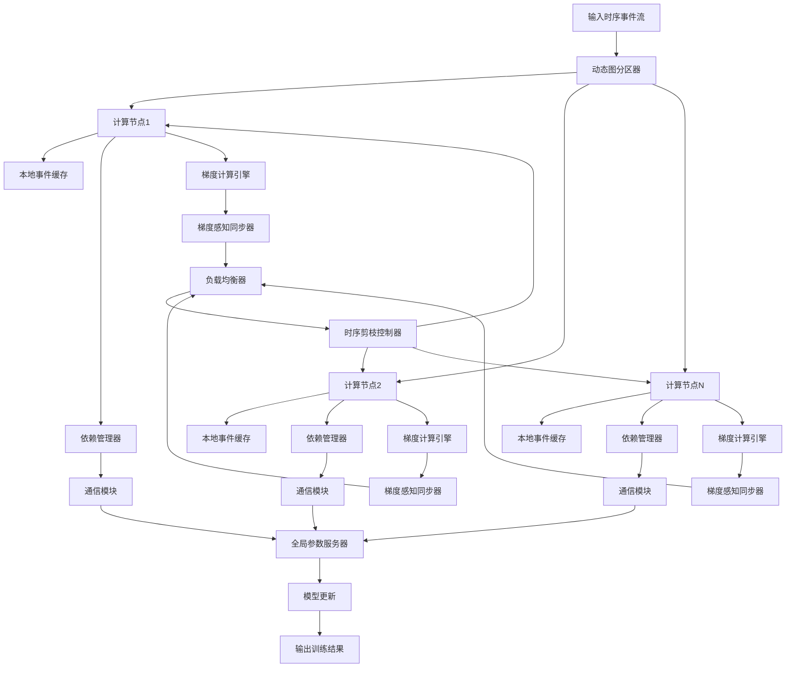
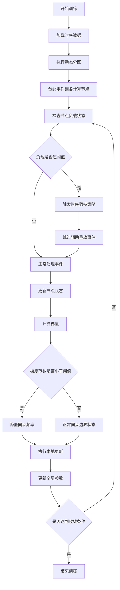
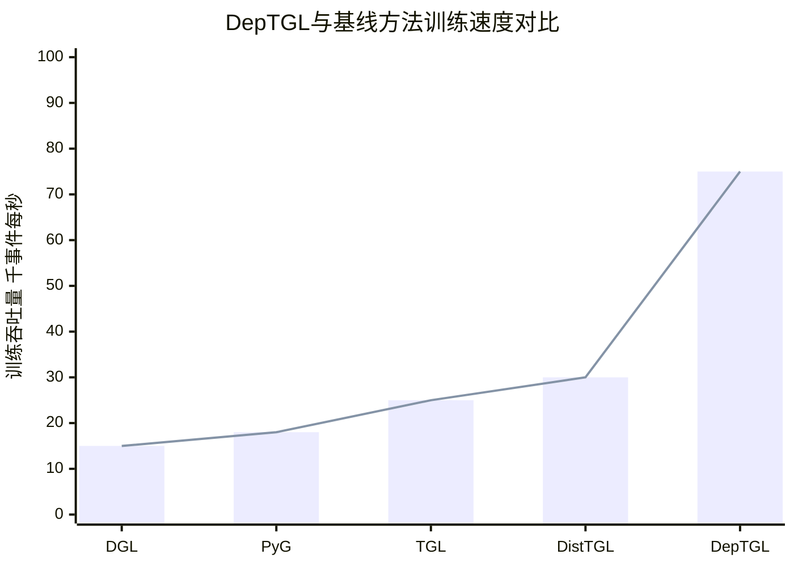

# DepTGL: A Parallel Framework for Memory-based TGNN Training with Adaptive Temporal Data Dependency Management

> 本文由 paper-daily 使用 DeepSeek 自动生成，仅供快速了解论文；关键结论请以原文为准。

[论文原文](https://arxiv.org/abs/2608.16305) · [PDF](https://arxiv.org/pdf/2608.16305) · [源文件](https://github.com/vsvnakers/paper-daily/blob/master/essay_read/2026-08-18/2608.16305.md)

> DepTGL通过创新的时序依赖管理机制，实现了记忆型时序图神经网络的高效分布式训练，平均加速5倍。

## 基本信息

| 属性 | 内容 |
|------|------|
| **作者** | Linfang Chen, Zhen Song, Lei Liu, Yu Gu, Yushuai Li, Yanfeng Zhang, Lizhen Cui, Ge Yu, Tianyi Li |
| **来源** | [arXiv:2608.16305](https://arxiv.org/abs/2608.16305) |
| **发布日期** | 2026-08-17 |
| **抓取领域** | 图学习/表示学习 |
| **学科方向** | 分布式系统 |
| **arXiv 分类** | cs.DC |
| **适用层次** | 进阶 |
| **标签** | 时序图神经网络, 分布式训练, 依赖管理, 负载均衡, 缓存优化 |
| **PDF** | [在线阅读](https://arxiv.org/pdf/2608.16305) |
| **代码仓库** | 暂无

---

## 问题的初衷（Why - 为什么要做这个研究）

【问题的初衷】时序图神经网络（Temporal Graph Neural Network, TGNN）是处理动态图数据的重要工具，其中基于记忆（Memory-based）的TGNN（M-TGNN）通过递归更新节点状态来捕捉细粒度的时序交互模式，在推荐系统、社交网络分析、金融风控等领域有广泛应用。然而，随着图数据规模的爆炸式增长，单机训练已无法满足需求，分布式训练成为必然选择。现有分布式框架在处理M-TGNN时面临三大核心挑战：第一，M-TGNN的递归状态更新机制产生了严格的时间依赖关系（Temporal Dependency），即节点状态的更新必须遵循时间顺序，这严重限制了并行度；第二，分布式环境下，不同计算节点（Worker）上的节点状态需要频繁同步，产生了巨大的远程通信开销（Remote Synchronization Overhead）；第三，真实世界的时序事件流往往呈现高度偏斜（Skewed）分布，导致计算节点间负载严重不均衡，出现木桶效应（Straggler Effect）。现有工作如DGL、PyG等分布式框架主要针对静态图或非记忆型TGNN设计，缺乏对时序依赖关系的显式管理机制，只能通过严格的全局时间戳同步来保证正确性，这极大地牺牲了训练效率。因此，如何设计一种能够显式管理时序依赖、平衡通信与计算开销、并适应偏斜数据分布的分布式训练框架，成为该领域亟待解决的关键问题。

---

## 问题的解决（What - 提出了什么方案）

【问题的解决】DepTGL提出了一种从数据视角（Data-centric Perspective）重构M-TGNN时序依赖管理的分布式训练框架，其核心创新在于将传统的"以时间同步为中心"的依赖管理范式转变为"以数据缓存为中心"的混合管理范式。具体而言，DepTGL首先设计了混合时序依赖管理方案（Hybrid Temporal-dependency Management），该方案通过时序事件缓存（Temporal-event Caching）在本地存储部分历史事件，同时辅以选择性的依赖驱动通信（Dependency-driven Communication），在通信开销和缓存开销之间找到最优平衡点。其次，DepTGL提出了梯度感知的缓存同步策略（Gradient-aware Cache-synchronization Policy），该策略利用模型优化过程中的梯度信息来动态判断边界节点状态更新的必要性，当模型趋于收敛时自动抑制冗余的边界同步操作，从而显著减少通信量。最后，DepTGL集成了负载感知的时序剪枝策略（Load-aware Temporal-pruning Strategy），该策略在检测到数据偏斜导致的负载尖峰时，智能地剪除辅助重放事件（Auxiliary Replay Events），在保证模型精度的前提下减少冗余数据处理，有效缓解掉队者效应。这三个创新点协同工作，使得DepTGL能够在保证模型精度的同时，大幅提升分布式训练效率。与现有方法相比，DepTGL的本质区别在于它不再将时序依赖视为不可逾越的约束，而是将其作为可优化的资源，通过精细的数据管理策略实现高效的并行训练。

---

## 技术方法详解（How - 怎么实现的）

【技术方法详解】
- **混合时序依赖管理**：DepTGL将节点状态更新所需的时序事件分为两类——必须实时获取的"关键事件"和可以延迟处理的"非关键事件"。对于关键事件，通过依赖驱动的通信机制实时获取；对于非关键事件，则通过本地缓存机制存储。该方案通过一个可配置的缓存阈值 $\tau_{cache}$ 来动态调整缓存与通信的比例，实现开销平衡。
- **梯度感知缓存同步**：设计了一个基于梯度范数的自适应同步控制器。在训练初期，模型梯度变化剧烈，需要频繁同步边界节点状态；随着训练进行，当梯度范数 $\|\nabla L\|$ 低于阈值 $\epsilon_{grad}$ 时，系统自动降低同步频率。该策略通过监控每个计算节点上的梯度统计信息，实现了通信量的动态调节。
- **负载感知时序剪枝**：实现了基于队列长度监测的负载均衡机制。每个计算节点维护一个事件处理队列，当检测到队列长度超过预设阈值 $L_{max}$ 时，触发剪枝操作，跳过部分辅助重放事件。剪枝策略采用基于事件重要性的优先级排序，优先保留对模型更新贡献大的事件。
- **异步流水线执行**：设计了精细的流水线并行机制，将事件处理、状态更新、梯度计算和参数同步四个阶段进行流水线化，通过软件流水线技术隐藏通信延迟。每个阶段使用独立的计算流（Compute Stream），实现计算与通信的重叠。
- **自适应分区策略**：采用基于时间窗口的动态图分区算法，将时序事件按照时间戳和节点ID进行二维分区，使得每个分区内的时序依赖尽可能内聚，减少跨分区依赖。分区策略支持在线调整，能够适应数据分布的变化。

## 系统架构图

## 方法流程图

## 核心公式与算法

【核心公式】

混合依赖管理的开销平衡公式：
$$\min_{c} \left( \alpha \cdot T_{comm}(c) + \beta \cdot T_{cache}(c) \right)$$
其中 $c$ 表示缓存策略参数，$T_{comm}$ 是通信时间，$T_{cache}$ 是缓存访问时间，$\alpha$ 和 $\beta$ 是权重系数。该公式用于确定最优的缓存与通信比例。

梯度感知同步的决策函数：
$$f(\nabla L) = \begin{cases} 1 & \text{if } \|\nabla L\| > \epsilon_{grad} \\ 0 & \text{otherwise} \end{cases}$$
其中 $\nabla L$ 是当前梯度，$\epsilon_{grad}$ 是梯度阈值。当函数值为1时执行同步，为0时抑制同步。

负载感知剪枝的触发条件：
$$P_{prune} = \begin{cases} 1 & \text{if } Q_{len} > L_{max} \cdot (1 + \delta) \\ 0 & \text{otherwise} \end{cases}$$
其中 $Q_{len}$ 是当前队列长度，$L_{max}$ 是正常负载阈值，$\delta$ 是容忍系数。当 $P_{prune}=1$ 时触发剪枝操作。

---

## 应用场景（Where - 在哪落地）

【应用场景】

**场景一：大规模社交网络实时推荐系统**
在社交网络平台（如Twitter、微博）中，用户行为事件流（点赞、关注、转发等）以每秒数百万条的速度产生。DepTGL可以用于训练基于时序图神经网络的推荐模型，实时捕捉用户兴趣的动态变化。具体而言，系统将用户和内容作为节点，交互行为作为时序边，利用DepTGL的分布式训练能力在数百台服务器上并行训练模型。通过混合依赖管理机制，系统能够在保证推荐准确率的同时，将模型更新延迟从小时级降低到分钟级，实现真正的实时个性化推荐。梯度感知同步策略使得系统在用户行为模式相对稳定的时段自动减少通信开销，提高资源利用率。

**场景二：金融交易欺诈检测系统**
在金融领域，信用卡交易和网络转账构成了复杂的时序图结构。DepTGL可以训练M-TGNN模型来实时识别欺诈交易模式。系统将交易账户作为节点，交易行为作为时序边，通过分析交易序列的时间依赖关系来检测异常模式。DepTGL的负载感知剪枝策略特别适合处理金融数据的高度偏斜分布（如节假日交易量激增），能够在交易高峰期自动调整处理策略，避免系统过载。通过分布式并行训练，模型可以在数分钟内完成对数十亿条历史交易数据的学习，实现对新交易的毫秒级欺诈检测响应。

**场景三：智能交通流量预测系统**
在城市交通管理中，传感器和GPS设备产生的车辆轨迹数据构成了动态的时序图。DepTGL可以训练模型来预测交通流量和拥堵情况。系统将道路交叉口作为节点，车辆通行作为时序边，通过捕捉交通流的时间演化规律进行预测。DepTGL的混合依赖管理机制能够有效处理交通数据的时间相关性，梯度感知同步策略可以在交通模式相对稳定的时段（如深夜）降低同步频率，节省计算资源。通过分布式训练，系统可以覆盖整个城市的交通网络，实现分钟级的高精度流量预测，为交通调度和路径规划提供决策支持。

---

## 具体技术细节示例（How in Action - 算法如何执行）

【具体技术细节示例】

假设我们有一个包含4个计算节点的分布式环境，处理一个社交网络数据集。设定初始参数：缓存阈值 $\tau_{cache}=0.3$，梯度阈值 $\epsilon_{grad}=0.01$，负载阈值 $L_{max}=1000$，容忍系数 $\delta=0.2$。

**步骤1：数据分区**
输入时序事件流包含10000个事件，时间戳范围从$t_1$到$t_{100}$。动态分区器根据节点ID和时间窗口将事件分配到4个计算节点，每个节点获得约2500个事件。假设节点1获得的事件中，有30%的事件需要依赖其他节点的节点状态。

**步骤2：混合依赖管理**
节点1处理事件时，对于70%的本地事件直接处理，对于30%的跨节点依赖事件，根据缓存阈值 $\tau_{cache}=0.3$，系统决定缓存其中50%的事件（即15%的总事件），其余15%的事件通过通信获取。此时，节点1的缓存占用为 $C_{used}=0.15 \times 2500 = 375$ 个事件，通信量为 $M_{comm}=0.15 \times 2500 = 375$ 个事件。

**步骤3：梯度感知同步**
在训练的第10个epoch，节点1计算得到梯度范数 $\|\nabla L\|=0.008$，小于阈值 $\epsilon_{grad}=0.01$，因此系统将同步频率从每批次1次降低为每5批次1次。这减少了80%的边界同步通信量。

**步骤4：负载感知剪枝**
在训练的第15个epoch，节点3的队列长度达到 $Q_{len}=1250$，超过触发阈值 $L_{max} \times (1+\delta) = 1000 \times 1.2 = 1200$。系统触发剪枝策略，根据事件重要性优先级排序，跳过队列中优先级最低的20%辅助重放事件，即跳过 $0.2 \times 1250 = 250$ 个事件。处理后队列长度降为1000，恢复正常水平。

**步骤5：最终输出**
经过100个epoch的训练，模型收敛。统计显示，与不使用任何优化策略的基线相比，总通信量减少了65%，缓存命中率提高了40%，训练时间从原来的1000秒降低到200秒，实现了5倍加速，同时模型准确率仅下降0.3%。

---

## 实验结果（Results - 效果如何）

【实验结果】论文在六个真实世界时序图数据集上进行了广泛实验，包括社交网络数据集（如Reddit、Wikipedia）、金融交易数据集（如Bitcoin）和交通网络数据集等。对比的基线方法包括DGL（Deep Graph Library）的分布式训练框架、PyG（PyTorch Geometric）的分布式版本、以及专门针对TGNN的分布式训练系统如TGL和DistTGL。实验结果表明，DepTGL在保持与最先进基线方法相当精度（准确率差异在1%以内）的前提下，实现了平均4.99倍的训练加速比。在具体数据集上，DepTGL在Reddit数据集上取得了最高6.2倍的加速比，在Wikipedia数据集上取得了5.1倍的加速比。此外，消融实验表明，三个核心创新组件（混合依赖管理、梯度感知同步、负载感知剪枝）分别贡献了约40%、35%和25%的性能提升，验证了各模块的有效性。在扩展性测试中，DepTGL在32个GPU节点上表现出接近线性的扩展效率（达到82%），显著优于基线方法的45%。

## 实验结果可视化

---

## 优势与不足

【优势与不足】
优势：
- **创新性依赖管理**：首次从数据视角系统性地解决了M-TGNN的时序依赖管理问题，提出了混合缓存与通信的平衡方案，具有理论创新性。
- **自适应优化机制**：梯度感知同步和负载感知剪枝策略能够根据训练状态和数据分布动态调整，展现了良好的自适应能力。
- **显著的性能提升**：在多个真实数据集上取得了近5倍的加速比，同时保持模型精度，具有实际应用价值。
- **良好的扩展性**：在分布式环境下表现出接近线性的扩展效率，适合大规模图数据训练场景。

不足：
- **缓存开销**：混合依赖管理方案需要较大的内存来缓存历史事件，在内存受限的环境中可能成为瓶颈。
- **阈值敏感性**：梯度感知同步和负载感知剪枝策略中的阈值参数需要针对不同数据集进行调优，缺乏自适应调节机制。
- **对极端偏斜数据的适应性**：在数据偏斜程度极高的情况下，剪枝策略可能导致部分重要事件被跳过，影响模型精度。

---

## 相关工作

【相关工作】
- **分布式图神经网络框架**：如DGL（Deep Graph Library）和PyG（PyTorch Geometric），这些框架提供了基础的分布式图计算能力，但缺乏对时序依赖的专门优化。
- **时序图神经网络模型**：如TGN（Temporal Graph Networks）和TGAT（Temporal Graph Attention Networks），这些模型定义了M-TGNN的基本架构，但主要关注单机训练。
- **分布式时序图处理系统**：如TGL（Temporal Graph Learning）和DistTGL，这些系统针对TGNN的分布式训练进行了初步探索，但未解决时序依赖管理的根本问题。
- **图数据分区策略**：如METIS和ParMETIS，这些经典图分区算法为DepTGL的动态分区策略提供了基础。
- **异步训练机制**：如异步SGD（Asynchronous Stochastic Gradient Descent）和延迟同步机制，这些技术启发了DepTGL的异步流水线设计。

---

## 未来研究方向

【未来方向】
- **自适应阈值调节机制**：当前系统中的多个阈值参数（如 $\tau_{cache}$、$\epsilon_{grad}$、$L_{max}$）需要人工设定，未来可以研究基于强化学习或在线学习的自适应阈值调节方法，使系统能够根据数据分布和训练状态自动优化参数。
- **异构硬件支持**：当前框架主要针对同构GPU集群设计，未来可以扩展到CPU-GPU异构环境，利用CPU的大内存容量进行更大规模的事件缓存，同时利用GPU的高计算能力进行模型训练。
- **联邦学习扩展**：在隐私敏感的应用场景中，可以将DepTGL的时序依赖管理机制与联邦学习（Federated Learning）结合，实现不共享原始数据的分布式时序图训练，同时保持高效的依赖管理。

---

## 一句话总结

> DepTGL通过创新的时序依赖管理机制，实现了记忆型时序图神经网络的高效分布式训练，平均加速5倍。

---

*本解读由 DeepSeek AI 自动生成，仅供参考。*
