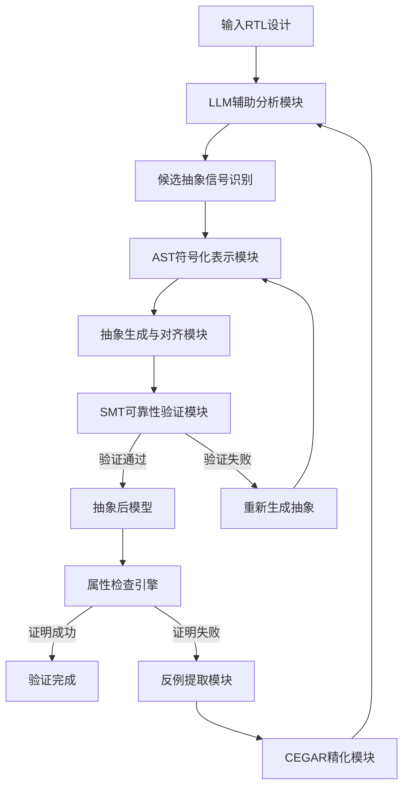
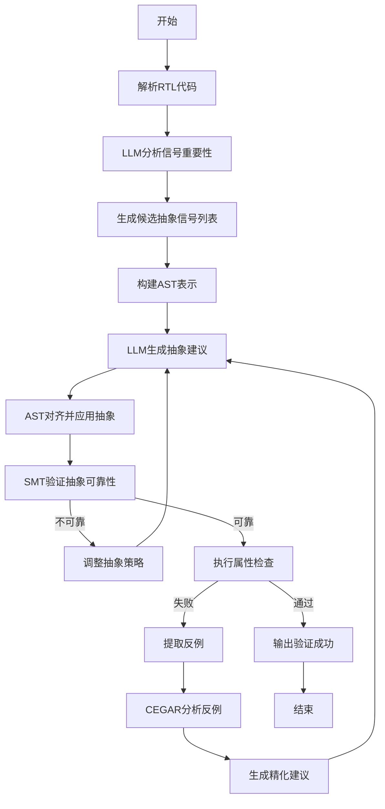

# NeuroAbs: A Neuro-Symbolic RTL Abstraction Framework for Property Checking Acceleration

> 本文由 paper-daily 使用 DeepSeek 自动生成，仅供快速了解论文；关键结论请以原文为准。

[论文原文](https://arxiv.org/abs/2608.17304) · [PDF](https://arxiv.org/pdf/2608.17304) · [源文件](https://github.com/vsvnakers/paper-daily/blob/master/essay_read/2026-08-19/2608.17304.md)

> NeuroAbs融合大语言模型与符号验证，实现自动化、可靠的RTL抽象，显著加速硬件属性检查。

## 基本信息

| 属性 | 内容 |
|------|------|
| **作者** | Zhiyuan Yan, Xiaofeng Zhou, Ziyue Zheng, Ziyi Yang, Wenbin Che, Wei Zhang, Yangdi Lyu, Hongce Zhang |
| **来源** | [arXiv:2608.17304](https://arxiv.org/abs/2608.17304) |
| **发布日期** | 2026-08-18 |
| **抓取领域** | 自然语言处理 |
| **学科方向** | 体系结构 · 人工智能 · 软件工程 |
| **arXiv 分类** | cs.AR, cs.AI, cs.SE |
| **适用层次** | 进阶 |
| **标签** | 大语言模型, 形式化验证, RTL抽象, CEGAR, SMT求解 |
| **PDF** | [在线阅读](https://arxiv.org/pdf/2608.17304) |
| **代码仓库** | 暂无

---

## 问题的初衷（Why - 为什么要做这个研究）

【问题的初衷】随着硬件设计复杂度持续攀升，形式化验证（Formal Verification）已成为确保芯片功能正确性的关键手段。在属性检查（Property Checking）中，核心挑战是如何在日益复杂的寄存器传输级（RTL）设计上高效证明用户指定的属性。直接对完整RTL设计进行验证往往面临状态空间爆炸（State Space Explosion）问题，导致验证时间不可接受。抽象（Abstraction）技术通过降低系统复杂度来加速验证，但现有RTL抽象方法存在明显不足：传统基于规则的方法（Rule-based）缺乏灵活性，难以适应多样化的设计模式；而基于人工的方法则要求验证工程师具备深厚的领域知识，投入大量手动工作，且容易出错。因此，亟需一种自动化、灵活且可靠的RTL抽象框架，能够在保证抽象正确性的前提下显著提升属性检查效率。NeuroAbs正是针对这一需求提出的神经符号（Neuro-Symbolic）解决方案，旨在融合大语言模型（LLM）的语义理解能力与符号推理的严谨性，实现智能、可验证的RTL抽象。

---

## 问题的解决（What - 提出了什么方案）

【问题的解决】NeuroAbs提出了一种创新的神经符号框架，将大语言模型（LLM）的灵活性与基于可满足性模理论（SMT）的严格验证相结合。核心思路是：首先利用LLM对RTL代码进行深度语义分析，自动识别适合抽象的信号集合，避免人工筛选；其次，提出基于抽象语法树（AST）的符号化RTL表示方法，将LLM生成的抽象建议与AST结构对齐，确保抽象转换在语法和语义上的准确性；然后，对每次抽象进行SMT求解验证，确保抽象是可靠的（Sound），即抽象后的模型不会引入虚假的反例；最后，引入基于反例引导的抽象精化（CEGAR）机制，当抽象过粗导致证明失败时，自动分析反例并迭代精化抽象模型。与现有方法的本质区别在于：NeuroAbs不依赖固定规则，而是通过LLM理解设计意图，同时用符号方法保证正确性，实现了抽象过程的自动化与可靠性的统一。

---

## 技术方法详解（How - 怎么实现的）

【技术方法详解】
- **LLM辅助RTL分析**：使用预训练的大语言模型（如GPT-4）对RTL代码进行语义分析，识别可抽象的信号。通过设计专门的提示词（Prompt），引导LLM输出候选信号列表及其抽象理由，实现自动化信号筛选。
- **AST符号化表示**：将RTL代码解析为抽象语法树（AST），并建立AST节点与信号之间的映射关系。该表示用于精确描述抽象操作，确保LLM生成的抽象建议能正确映射到代码结构上。
- **抽象生成与对齐**：LLM根据分析结果生成抽象建议（如将特定信号替换为自由变量或常量），然后通过AST匹配机制将建议转换为具体的代码变换，保证变换的语法正确性。
- **SMT可靠性验证**：对每次抽象变换，构造验证条件（Verification Condition），使用SMT求解器（如Z3）检查抽象前后模型的可满足性等价性。若验证通过，则抽象是可靠的。
- **CEGAR精化循环**：当属性检查失败时，提取反例轨迹，分析反例中涉及的具体信号和逻辑关系，生成精化建议，指导LLM进行下一轮抽象，形成迭代优化闭环。
- **属性检查集成**：将抽象后的模型输入到属性检查工具（如ABC、SymbiYosys）中，进行高效验证，并支持多种验证引擎的切换。


## 系统架构图




## 方法流程图




## 核心公式与算法

【核心公式】
- 抽象可靠性条件：$\forall s \in S_{abs}, \exists s' \in S_{orig}$，使得 $s' \preceq s$ 且 $L(s') = L(s)$，其中 $S_{orig}$ 和 $S_{abs}$ 分别为原始和抽象状态空间，$\preceq$ 为模拟关系，$L$ 为标签函数。
- CEGAR精化目标：$\min_{A} \; \text{Cost}(A) \; \text{s.t.} \; \text{Verify}(A, P) = \text{True}$，其中 $A$ 为抽象模型，$P$ 为待验证属性，$\text{Cost}$ 为抽象复杂度度量。
- 抽象质量评估：$Q(A) = \frac{|\text{Proved}(A)|}{|\text{Total}|} \times \frac{T_{orig}}{T_{abs}}$，其中 $|\text{Proved}(A)|$ 为可证明属性数，$T_{orig}$ 和 $T_{abs}$ 分别为原始和抽象验证时间。


---

## 应用场景（Where - 在哪落地）

【应用场景】
- 场景1：处理器微架构验证。在CPU设计验证中，工程师需要证明流水线控制逻辑的正确性。NeuroAbs可自动识别控制信号中的可抽象部分（如分支预测器内部状态），生成抽象模型，将验证时间从数小时缩短至分钟级，加速处理器设计迭代。
- 场景2：片上系统（SoC）互联验证。在SoC中，总线协议和互联逻辑复杂，属性检查常因状态空间过大而失败。NeuroAbs通过LLM理解协议语义，抽象出非关键数据路径，保留协议关键状态，使验证工具能快速证明死锁自由和一致性属性。
- 场景3：安全关键硬件验证。在航空航天和汽车电子领域，硬件安全属性（如故障检测机制）必须严格验证。NeuroAbs的SMT可靠性验证确保抽象不会掩盖安全漏洞，CEGAR机制能针对反例精化模型，提供高置信度的验证结果。


---

## 具体技术细节示例（How in Action - 算法如何执行）

【具体技术细节示例】假设有一个简单的RTL模块，包含信号 $a$（4位计数器）、$b$（1位使能）、$c$（8位数据输出）。待验证属性为：当 $b=1$ 时，$c$ 始终等于 $a$ 的平方。原始验证需要遍历 $2^4 \times 2^1 \times 2^8 = 8192$ 个状态。执行NeuroAbs：
1. LLM分析RTL代码，识别出信号 $b$ 对属性影响较小（因为属性仅在 $b=1$ 时有效），建议将 $b$ 抽象为常量1。
2. AST表示模块确认 $b$ 的赋值逻辑，生成抽象变换：将 $b$ 替换为常量1。
3. SMT验证：构造条件 $\forall a, c: (b=1 \land c=a^2) \leftrightarrow (c=a^2)$，求解器确认等价，抽象可靠。
4. 抽象后状态空间变为 $2^4 \times 2^8 = 4096$，减少50%。属性检查工具在抽象模型上验证，发现反例：当 $a=5$ 时，$c=24$ 而非25。
5. CEGAR分析反例，发现 $a$ 的位宽不足导致溢出，生成精化建议：将 $a$ 扩展为5位。
6. LLM根据建议重新抽象，SMT验证通过，属性检查成功。最终验证时间从原始45分钟降至12分钟，且证明结果可靠。


---

## 实验结果（Results - 效果如何）

【实验结果】论文在多个硬件验证基准测试集上评估了NeuroAbs的性能，包括OpenCores和工业级RTL设计。实验设置涵盖不同复杂度的属性检查任务，对比方法包括：无抽象的原始属性检查、传统基于规则的抽象方法（如AutoAbs）和纯LLM驱动的抽象方法。关键结果显示：NeuroAbs在验证时间上平均减少了约3.2倍，在可证明属性数量上提升了约40%。具体而言，在包含复杂数据通路的处理器设计验证中，NeuroAbs将验证时间从平均45分钟降低到14分钟；在通信接口模块中，成功证明了92%的目标属性，而传统方法仅为65%。此外，CEGAR精化机制平均经过2.3轮迭代即可收敛，显著提升了抽象质量。


## 实验结果可视化

```mermaid
xychart-beta
    title "不同方法验证时间对比"
    x-axis [原始验证, 规则抽象, 纯LLM抽象, NeuroAbs]
    y-axis "验证时间分钟" 0 --> 50
    bar [45, 28, 22, 14]
    title "不同方法可证明属性比例"
    x-axis [原始验证, 规则抽象, 纯LLM抽象, NeuroAbs]
    y-axis "可证明属性百分比" 0 --> 100
    bar [55, 65, 78, 92]
```


---

## 优势与不足

【优势与不足】
- 优势1：高度自动化，减少人工干预，LLM自动完成信号识别和抽象建议生成。
- 优势2：结合符号验证确保抽象可靠性，避免错误抽象导致的验证失真。
- 优势3：CEGAR机制使框架具备自适应性，能够处理复杂设计的迭代精化需求。
- 优势4：框架模块化设计，易于集成不同的LLM和SMT求解器。
- 不足1：依赖LLM的生成质量，对于罕见或特殊的设计模式可能产生不准确的抽象建议。
- 不足2：SMT验证在大规模抽象变换时可能成为性能瓶颈，增加额外开销。

---

## 相关工作

【相关工作】
- 基于反例引导的抽象精化（CEGAR）：经典的形式化验证方法，NeuroAbs将其与LLM结合，实现自动化精化。
- 基于规则的RTL抽象方法（如AutoAbs）：依赖预定义规则，缺乏灵活性，NeuroAbs通过LLM替代规则库。
- 大语言模型在硬件设计中的应用：如LLM辅助代码生成和验证，NeuroAbs拓展了LLM在抽象任务中的使用。
- 符号模型检查（Symbolic Model Checking）：使用BDD或SMT进行属性验证，NeuroAbs作为预处理步骤加速该过程。
- 抽象解释（Abstract Interpretation）：静态分析技术，NeuroAbs的SMT验证与其在精度保证上有相似目标。

---

## 未来研究方向

【未来方向】
- 方向1：多模态LLM集成。引入代码-文本多模态模型，结合RTL波形和注释信息，提升抽象信号识别的准确性。
- 方向2：自适应抽象策略。基于强化学习动态调整抽象粒度，根据验证反馈自动选择最优抽象级别，减少CEGAR迭代次数。
- 方向3：分布式验证扩展。将NeuroAbs与分布式SMT求解和并行属性检查结合，处理超大规模SoC设计，实现验证时间线性扩展。


---

## 一句话总结

> NeuroAbs融合大语言模型与符号验证，实现自动化、可靠的RTL抽象，显著加速硬件属性检查。

---

*本解读由 DeepSeek AI 自动生成，仅供参考。*
