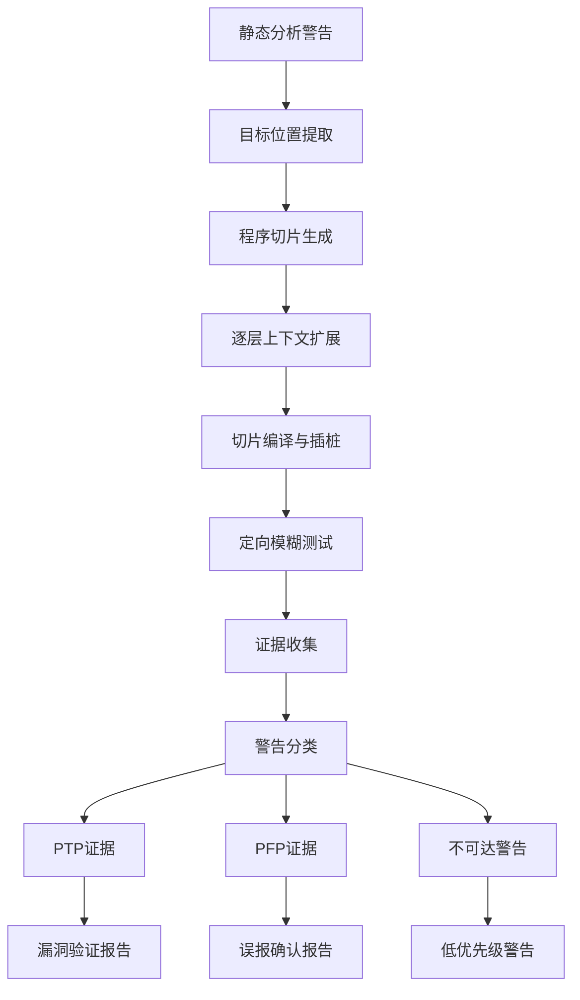
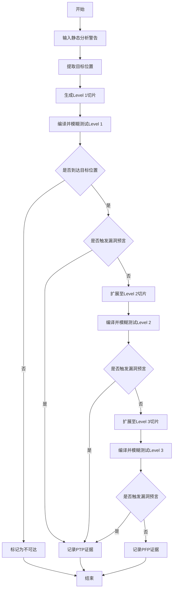
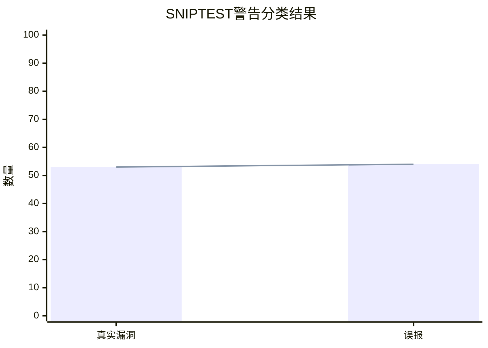

# SNIPTEST: Fuzzing Multi-Level Code Slices for Validating Vulnerabilities

> 本文由 paper-daily 使用 DeepSeek 自动生成，仅供快速了解论文；关键结论请以原文为准。

[论文原文](https://arxiv.org/abs/2608.17396) · [PDF](https://arxiv.org/pdf/2608.17396) · [源文件](https://github.com/vsvnakers/paper-daily/blob/master/essay_read/2026-08-19/2608.17396.md)

> SNIPTEST通过逐层代码切片和定向模糊测试，高效验证静态分析警告，实现自动化漏洞分流。

## 基本信息

| 属性 | 内容 |
|------|------|
| **作者** | Aniruddhan Murali, Nobble Saji Mathews, Mahmoud Alfadel, Meng Xu, Meiyappan Nagappan |
| **来源** | [arXiv:2608.17396](https://arxiv.org/abs/2608.17396) |
| **发布日期** | 2026-08-18 |
| **抓取领域** | 软件工程 · 分析/测试/合成 |
| **学科方向** | 软件工程 |
| **arXiv 分类** | cs.SE |
| **适用层次** | 进阶 |
| **标签** | 代码切片, 定向模糊测试, 警告分流, 漏洞验证, 静态分析 |
| **PDF** | [在线阅读](https://arxiv.org/pdf/2608.17396) |
| **代码仓库** | 暂无

---

## 问题的初衷（Why - 为什么要做这个研究）

【问题的初衷】现代软件系统日益复杂，静态分析工具（Static Analysis Tools）被广泛用于识别潜在漏洞代码，通过发出警告（Warning）来提示开发者。然而，这些警告往往需要人工检查以确认报告的问题是否真实存在，这一过程既耗时又容易出错。定向模糊测试（Directed Fuzzing）作为一种自动化验证警告的技术应运而生，它通过引导模糊测试器（Fuzzer）向目标代码位置生成输入，以触发潜在漏洞。然而，针对每个警告在整个项目上应用定向模糊测试在计算上是不可行的，通常需要数天的执行时间，且只能获得代码覆盖率（Code Coverage）的微小提升。这种全项目级别的模糊测试方法效率极低，无法满足实际开发中对警告进行快速、准确分类的需求。因此，亟需一种更高效的执行型警告分流（Warning Triage）框架，能够在可接受的时间成本内，为静态分析警告提供可靠的验证证据，从而减少人工审查负担，提升软件安全分析的自动化水平。

---

## 问题的解决（What - 提出了什么方案）

【问题的解决】SNIPTEST提出了一种基于执行（Execution-Based）的警告分流框架，其核心思路是生成并模糊测试围绕静态分析警告的编译后代码切片（Compiled Code Slices），而非在整个程序上运行模糊测试。该方法不试图证明漏洞在完整程序中的可利用性，而是通过逐步扩展切片执行上下文（Sliced Execution Contexts），提供关于警告行为方式的证据。SNIPTEST采用逐层切片策略（Layer-by-Layer Slicing Strategy），围绕目标位置增量扩展上下文，以越来越高的精度验证潜在漏洞。这种方法的本质区别在于，它将警告验证问题从全程序范围缩小到局部代码切片，大幅降低了计算复杂度，同时通过多层级切片提供了由粗到细的验证证据，使得警告分类（True Positive vs. False Positive）更加可靠和高效。

---

## 技术方法详解（How - 怎么实现的）

【技术方法详解】
- **代码切片生成（Code Slice Generation）**：SNIPTEST首先从静态分析警告中提取目标位置（Target Location），包括文件、函数和行号。然后，它基于程序依赖图（Program Dependency Graph, PDG）执行程序切片（Program Slicing），生成包含目标位置的最小可编译代码切片。
- **逐层上下文扩展（Layer-by-Layer Context Expansion）**：框架采用分层策略，从最小切片（Level 1）开始，逐步向外扩展上下文（Level 2、Level 3），每一层都包含更多的相关代码，以提供更全面的执行环境。这种设计允许在保持效率的同时，逐步增加验证的精度。
- **编译与插桩（Compilation and Instrumentation）**：每个切片被编译为可执行二进制文件，并插入探针（Probe）以监控目标位置的行为，包括是否到达警告位置（Reachability）以及是否触发漏洞预言（Bug Oracle）。
- **定向模糊测试（Directed Fuzzing）**：对每个切片运行定向模糊测试，使用覆盖引导（Coverage-Guided）的模糊测试器（如LibFuzzer或AFL）生成输入，目标是到达目标位置并触发异常行为（如崩溃、断言失败等）。
- **证据聚合与分类（Evidence Aggregation and Classification）**：收集所有切片级别的模糊测试结果，包括是否到达目标、是否触发预言、以及触发时的调用栈（Call Stack）。基于这些证据，SNIPTEST将警告分类为“可能的真阳性（Possible True Positive, PTP）”或“可能的假阳性（Possible False Positive, PFP）”，并输出相应的证据报告。


## 系统架构图




## 方法流程图




## 核心公式与算法

$$\text{Slice}_L = \text{Slice}(P, \text{Target}, L)$$ 其中，$\text{Slice}_L$ 表示第 $L$ 层切片，$P$ 是原始程序，$\text{Target}$ 是目标位置，$L$ 是上下文扩展层级。该公式描述了逐层切片生成过程。

$$\text{Evidence} = \{\text{Reach}, \text{Oracle}, \text{Stack}_k\}$$ 其中，$\text{Reach}$ 表示是否到达目标位置，$\text{Oracle}$ 表示是否触发漏洞预言，$\text{Stack}_k$ 表示前 $k$ 个栈帧。该公式定义了收集的证据类型。

$$\text{Classification} = \begin{cases} \text{PTP} & \text{if } \text{Reach} \land \text{Oracle} \\ \text{PFP} & \text{if } \text{Reach} \land \neg \text{Oracle} \\ \text{Unreachable} & \text{if } \neg \text{Reach} \end{cases}$$ 该公式定义了基于证据的警告分类逻辑。


---

## 应用场景（Where - 在哪落地）

【应用场景】
- **持续集成中的安全门禁（Security Gate in CI/CD）**：在持续集成（Continuous Integration, CI）流水线中，SNIPTEST可以自动验证静态分析工具报告的警告。当开发者提交代码时，SNIPTEST对新增警告进行快速验证，将真阳性漏洞阻止在合并前，同时减少误报对开发流程的干扰。预期效果是显著降低安全审查时间，提升发布速度。
- **安全审计与漏洞管理（Security Audit and Vulnerability Management）**：安全团队可以使用SNIPTEST对大型代码库进行定期扫描，自动分类静态分析警告，优先处理被标记为PTP的高风险漏洞。例如，在开源项目维护中，SNIPTEST可以快速识别CVE相关警告，帮助维护者及时修复。预期效果是提高漏洞发现和修复的响应速度，减少人工分析成本。
- **嵌入式系统固件分析（Firmware Analysis for Embedded Systems）**：在嵌入式系统（如IoT设备）的固件安全分析中，SNIPTEST可以针对固件中的静态分析警告生成切片并进行模糊测试，验证潜在漏洞。由于固件资源受限，全程序模糊测试不可行，SNIPTEST的切片方法特别适用。预期效果是提升固件安全性，防止远程代码执行等攻击。


---

## 具体技术细节示例（How in Action - 算法如何执行）

【具体技术细节示例】假设我们有一个简单的C程序，包含一个静态分析警告：在函数 `process_data` 中第10行存在空指针解引用（Null Pointer Dereference）风险。

**输入设定**：
- 程序 `P`：包含 `main` 函数调用 `process_data`，`process_data` 接收一个指针参数 `data`，在第10行执行 `*data = 1`。
- 警告目标：`process_data` 第10行。

**执行步骤**：
1. **目标位置提取**：SNIPTEST提取目标位置为 `process_data:10`。
2. **Level 1切片生成**：基于程序依赖图，生成包含第10行的最小切片，包括 `process_data` 函数体和必要的变量声明。切片代码为：
   ```c
   void process_data(int *data) {
       *data = 1; // 第10行
   }
   ```
3. **编译与插桩**：编译切片，并在第10行插入探针，记录是否到达以及是否触发空指针异常。
4. **Level 1模糊测试**：运行定向模糊测试，生成输入。由于切片缺少 `main` 函数，模糊测试器会生成随机指针值作为 `data`。假设模糊测试器生成 `data=NULL`，执行到第10行时触发空指针解引用，探针记录到达目标且触发漏洞预言（如SIGSEGV）。
5. **证据收集**：收集到证据：Reach=true, Oracle=true, Stack包含 `process_data`。
6. **分类**：由于Reach和Oracle均为真，SNIPTEST将警告分类为PTP。

**输出**：SNIPTEST输出“可能的真阳性”证据，并附上触发输入（如 `data=NULL`）和调用栈。开发者可以据此确认漏洞并修复。


---

## 实验结果（Results - 效果如何）

【实验结果】SNIPTEST在三个真实世界项目（包括OpenSSL、libpng和libtiff）的基准测试上进行了评估，该基准包含97个真实漏洞（True Vulnerabilities）和97个误报（False Alarms）。实验结果显示，SNIPTEST为53个（54.6%）已确认漏洞生成了“可能的真阳性”证据，这些证据在三个切片级别上一致触发了相应的漏洞预言，其余案例被判定为不可达。特别地，在40.2%的案例中，SNIPTEST沿观察到的执行路径利用了漏洞，匹配了前三个栈帧（Stack Frames）。对于97个已确认的误报，SNIPTEST为54个（55.6%）案例生成了“可能的假阳性”证据，即到达了警告位置但未触发漏洞预言，但错误分类了28个（28.8%）案例，其余案例不可达。此外，SNIPTEST成功识别了CVE-2025-11964，展示了其实际应用价值。


## 实验结果可视化




---

## 优势与不足

【优势与不足】
- **优势**：
  1. **高效性**：通过代码切片将模糊测试范围从全项目缩小到局部，大幅降低了计算开销，使得警告验证在可接受时间内完成。
  2. **分层证据**：逐层扩展上下文提供了多粒度的验证证据，增强了分类的可靠性，并支持对警告行为的深入理解。
  3. **自动化程度高**：整个流程从切片生成到模糊测试再到分类完全自动化，减少了人工审查需求，提升了安全分析的效率。
- **不足**：
  1. **误分类率**：在误报分类中，28.8%的案例被错误分类，表明当前方法在区分某些复杂模式时仍有局限，可能受切片不完整或模糊测试覆盖不足影响。
  2. **不可达案例**：部分警告被标记为不可达，可能是由于切片生成过程中丢失了必要的上下文，导致无法在切片中复现原始程序的执行路径。

---

## 相关工作

【相关工作】
- **定向模糊测试（Directed Fuzzing）**：如AFLGo和Hawkeye，它们通过距离引导模糊测试器向目标位置靠近，但通常需要全程序执行，效率较低。SNIPTEST通过切片避免了全程序模糊测试。
- **静态分析警告分类（Warning Triage）**：如Error Prone和SpotBugs，它们基于启发式规则或机器学习分类警告，但缺乏执行证据。SNIPTEST利用执行证据提供更可靠的分类。
- **程序切片（Program Slicing）**：如Weiser和Slicing工具，用于提取相关代码片段。SNIPTEST将切片与模糊测试结合，用于警告验证。
- **漏洞验证系统（Vulnerability Validation Systems）**：如CVEfixes和VulnLoc，它们专注于漏洞定位和修复，而SNIPTEST专注于警告验证和分类。

---

## 未来研究方向

【未来方向】
- **动态切片扩展策略**：当前逐层扩展是静态定义的，未来可以研究基于模糊测试反馈的动态切片扩展，即根据执行路径自动决定下一层包含哪些代码，以提高验证精度和效率。
- **多警告协同验证**：当多个警告位于相近代码区域时，可以共享切片和模糊测试结果，减少重复计算。未来可以探索批量验证机制，进一步提升框架的扩展性。
- **机器学习辅助分类**：结合机器学习模型对证据特征（如调用栈模式、切片复杂度）进行学习，以降低误分类率，特别是针对当前28.8%的错误分类案例。


---

## 一句话总结

> SNIPTEST通过逐层代码切片和定向模糊测试，高效验证静态分析警告，实现自动化漏洞分流。

---

*本解读由 DeepSeek AI 自动生成，仅供参考。*
