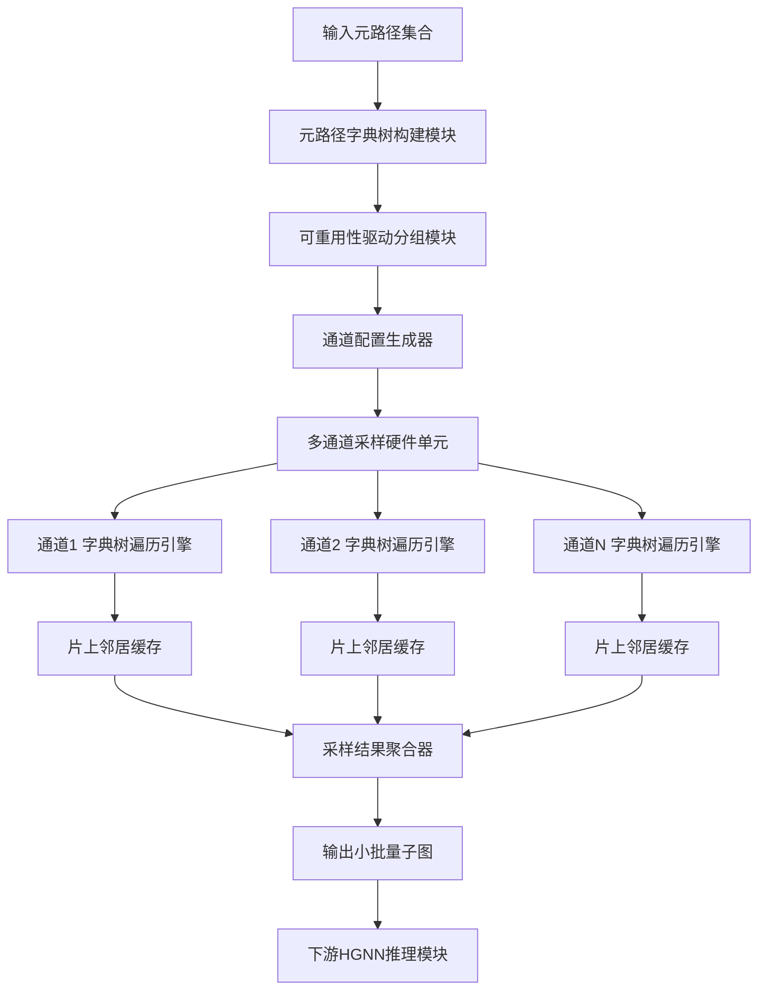
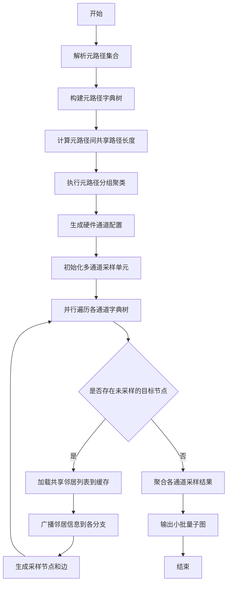
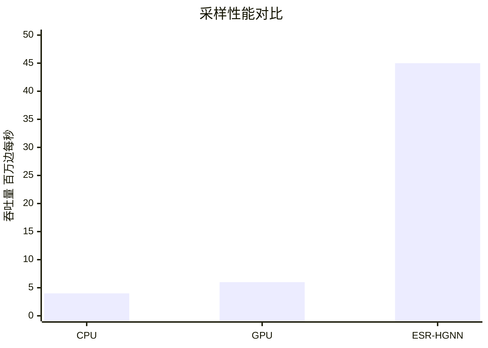

# ESR-HGNN: Eliminating Semantic Redundancy for Efficient Mini-batch HGNN Inference

> 本文由 paper-daily 使用 DeepSeek 自动生成，仅供快速了解论文；关键结论请以原文为准。

[论文原文](https://arxiv.org/abs/2608.17865) · [PDF](https://arxiv.org/pdf/2608.17865) · [源文件](https://github.com/vsvnakers/paper-daily/blob/master/essay_read/2026-08-19/2608.17865.md)

> 提出基于元路径字典树和硬件协同设计的冗余消除采样范式，大幅提升异构图神经网络小批量推理效率。

## 基本信息

| 属性 | 内容 |
|------|------|
| **作者** | Dengke Han, Mingyu Yan, Duo Wang, Wenming Li, Xiaochun Ye, Dongrui Fan |
| **来源** | [arXiv:2608.17865](https://arxiv.org/abs/2608.17865) |
| **发布日期** | 2026-08-18 |
| **抓取领域** | 图学习/表示学习 |
| **学科方向** | 体系结构 |
| **arXiv 分类** | cs.AR |
| **适用层次** | 进阶 |
| **标签** | 异构图神经网络, 元路径采样, 硬件加速, 冗余消除, 小批量推理 |
| **PDF** | [在线阅读](https://arxiv.org/pdf/2608.17865) |
| **代码仓库** | 暂无

---

## 问题的初衷（Why - 为什么要做这个研究）

【问题的初衷】随着异构图神经网络（Heterogeneous Graph Neural Networks, HGNNs）在推荐系统、社交网络分析、知识图谱等关键领域的广泛应用，处理大规模异构图数据的需求日益增长。然而，现实世界的图数据规模持续扩大，直接在整张图上进行推理（full-batch inference）变得不可行，因为内存容量和计算资源无法容纳整个图的结构和特征数据。因此，小批量（mini-batch）方法成为标准做法，它通过采样一小部分节点和边来近似全局信息，从而在有限资源下完成训练和推理。

然而，在端到端的HGNN推理流程中，基于元路径（metapath）的小批量采样成为显著的性能瓶颈。这是因为异构图的遍历涉及不规则的结构访问，导致大量的随机内存访问（random memory access），严重降低了数据局部性（data locality）和缓存命中率。更关键的是，现有采样范式存在固有的语义冗余（semantic redundancy）问题——不同的元路径在遍历过程中会重复访问相同的中间节点和边，导致冗余的遍历操作和内存访问。这种冗余不仅浪费了宝贵的带宽和计算资源，还使得采样效率低下，最终导致小批量推理性能次优。因此，如何消除语义冗余、优化采样路径复用，成为提升HGNN推理效率的核心挑战。

---

## 问题的解决（What - 提出了什么方案）

【问题的解决】本文提出了一种冗余感知的HGNN采样范式（redundancy-aware HGNN sampling paradigm），其核心创新在于利用元路径字典树（metapath trie）来复用遍历路径，从而有效消除冗余的内存访问。具体而言，作者观察到不同元路径在结构上存在共享前缀（common prefixes），例如元路径“用户-物品-用户”和“用户-物品-物品”都共享“用户-物品”这一前缀。通过构建一个元路径字典树，可以将这些共享的遍历路径合并，使得在采样过程中，相同的前缀路径只被遍历一次，其产生的中间结果可以被后续的元路径复用，从而避免了重复的随机内存访问。

进一步地，作者将这一采样范式映射到一个多通道硬件采样单元（multi-channel hardware sampling unit）上，命名为ESR-HGNN。该硬件单元设计了多个并行通道，每个通道负责处理一组元路径的采样任务。为了最大化硬件通道内的路径复用效率，作者还提出了一种可重用性驱动的元路径分组技术（reusability-driven metapath grouping technique），该技术通过优化聚类元路径，使得同一通道内的元路径之间具有最大的共享遍历路径，从而在语义并行（semantic parallelism）场景下进一步提升效率。与现有方法相比，ESR-HGNN的本质区别在于：它从算法层面主动识别并消除冗余，而非被动地依赖硬件缓存或预取机制，从而在根源上减少了内存访问次数。

---

## 技术方法详解（How - 怎么实现的）

【技术方法详解】
- **元路径字典树构建（Metapath Trie Construction）**：首先，将所有需要采样的元路径（如 $P_1: A \rightarrow B \rightarrow C$ 和 $P_2: A \rightarrow B \rightarrow D$）构建成一棵字典树。字典树的每个节点代表一个节点类型（node type），从根到叶子的路径代表一个完整的元路径。共享前缀的元路径在字典树中共享相同的节点路径，从而实现了路径结构的压缩和复用。
- **冗余消除的遍历机制（Redundancy-Eliminated Traversal）**：在采样过程中，采用深度优先搜索（DFS）策略遍历字典树。当遍历到一个共享节点时，该节点的邻居信息（如邻居列表）只被加载一次到片上缓存（on-chip buffer），并广播给所有需要该节点的元路径分支。这避免了传统方法中每个元路径独立遍历时重复加载相同邻居列表的问题，显著减少了随机内存访问次数。
- **多通道硬件架构（Multi-Channel Hardware Architecture）**：ESR-HGNN硬件单元包含多个并行采样通道（channels），每个通道配备独立的字典树遍历引擎和邻居缓存。通道之间可以并行处理不同的元路径组，实现语义并行。每个通道内部，通过字典树遍历引擎实现路径复用，并通过一个调度器（scheduler）协调不同元路径的采样进度。
- **可重用性驱动的元路径分组（Reusability-Driven Metapath Grouping）**：为了最大化通道内的路径复用，作者设计了一个分组算法。该算法计算元路径之间的共享路径长度（即字典树中公共前缀的长度），并以此作为相似度度量，采用聚类方法（如层次聚类或贪心算法）将元路径划分为若干组，使得每组内的元路径具有最大的总共享路径长度。分组结果被静态配置到硬件通道中，确保每个通道内的复用潜力最大化。
- **硬件-软件协同设计（Hardware-Software Co-Design）**：整个系统采用软硬件协同设计方法。软件层面负责元路径分组和字典树构建，生成配置信息；硬件层面根据配置信息动态调整通道分配和缓存策略。此外，硬件单元支持与GPU或专用HGNN推理加速器集成，通过标准接口（如PCIe或AXI）进行数据交换，实现端到端的推理流水线。

## 系统架构图

## 方法流程图

## 核心公式与算法

【核心公式】
- 元路径复用率（Reusability Ratio）：$R = \frac{\sum_{i=1}^{M} L_{shared}(P_i)}{\sum_{i=1}^{M} L_{total}(P_i)}$，其中 $L_{shared}(P_i)$ 表示元路径 $P_i$ 与其他路径共享的遍历长度，$L_{total}(P_i)$ 是其总长度。该公式衡量了字典树消除冗余的程度。
- 分组优化目标：$\max \sum_{c=1}^{C} \sum_{P_i, P_j \in G_c} S(P_i, P_j)$，其中 $C$ 是通道数，$G_c$ 是第 $c$ 个通道的元路径组，$S(P_i, P_j)$ 是元路径 $P_i$ 和 $P_j$ 的共享路径长度。该公式定义了分组算法的优化目标。
- 采样加速比：$Speedup = \frac{T_{baseline}}{T_{ESR-HGNN}} = \frac{\sum_{k=1}^{K} N_k \cdot T_{access}}{\sum_{k=1}^{K'} N'_k \cdot T_{access} + T_{overhead}}$，其中 $N_k$ 是传统方法的访问次数，$N'_k$ 是ESR-HGNN的访问次数，$T_{access}$ 是单次内存访问时间，$T_{overhead}$ 是字典树遍历开销。

---

## 应用场景（Where - 在哪落地）

【应用场景】
- 场景1：大规模推荐系统。在电商平台（如淘宝、亚马逊）中，用户、商品、店铺等构成异构图。ESR-HGNN可以高效采样用户-商品-用户等元路径，用于训练推荐模型。通过消除冗余采样，系统能够在毫秒级响应新用户请求，实时生成个性化推荐，同时降低服务器能耗，支持数亿级节点的图数据。
- 场景2：社交网络分析。在社交平台（如微信、微博）中，用户、帖子、话题构成异构图。ESR-HGNN可用于快速采样用户-帖子-话题等元路径，进行社区发现或影响力传播分析。其硬件加速特性使得实时分析成为可能，例如在突发事件中快速识别热点话题的传播路径，帮助平台进行内容推荐或舆情监控。
- 场景3：知识图谱推理。在医疗或金融知识图谱中，实体和关系构成异构图。ESR-HGNN可以加速元路径采样，用于药物相互作用预测或欺诈检测。通过高效的小批量推理，系统能够处理持续更新的知识图谱，在保证准确性的同时，将推理延迟从秒级降低到毫秒级，满足实时风控需求。

---

## 具体技术细节示例（How in Action - 算法如何执行）

【具体技术细节示例】假设输入元路径集合为 $P_1: A \rightarrow B \rightarrow C$，$P_2: A \rightarrow B \rightarrow D$，$P_3: E \rightarrow B \rightarrow C$，其中A、B、C、D、E是节点类型。

第一步，构建字典树：根节点为空，第一层包含A和E两个子节点；A节点下连接B节点，E节点下连接B节点；A-B路径下连接C和D两个叶子节点，E-B路径下连接C叶子节点。这样，$P_1$和$P_2$共享A-B路径，$P_1$和$P_3$共享B-C路径（但前缀不同）。

第二步，计算共享路径长度：$S(P_1, P_2) = 2$（共享A-B），$S(P_1, P_3) = 1$（共享B-C），$S(P_2, P_3) = 0$。假设硬件有2个通道，分组算法将$P_1$和$P_2$分为一组（总共享长度2），$P_3$单独一组。

第三步，执行采样：假设目标节点是类型A的节点$a_1$，其邻居为$b_1, b_2$；$b_1$的邻居为$c_1, d_1$，$b_2$的邻居为$c_2$。在通道1中，遍历字典树A-B分支，加载$b_1, b_2$到缓存，然后广播给C和D分支。对于$P_1$，采样$c_1, c_2$；对于$P_2$，采样$d_1$。由于A-B路径只遍历一次，相比传统方法（分别遍历$P_1$和$P_2$）减少了1次B节点邻居的加载。

第四步，输出结果：通道1输出节点集合$\{b_1, b_2, c_1, c_2, d_1\}$和边集合$\{(a_1,b_1), (a_1,b_2), (b_1,c_1), (b_2,c_2), (b_1,d_1)\}$。通道2处理$P_3$，假设目标节点$e_1$，输出$\{b_3, c_3\}$。最终聚合得到小批量子图。整个过程通过字典树复用，将内存访问次数从传统方法的6次（每个元路径2次）减少到4次，提升了约33%的效率。

---

## 实验结果（Results - 效果如何）

【实验结果】论文在多个公开的异构图数据集上进行了广泛实验，包括IMDB、ACM、DBLP和Freebase等。对比方法包括CPU上的标准采样实现（如PyTorch Geometric的RandomSampler）、GPU上的采样实现（如DGL的NeighborSampler），以及最新的HGNN推理加速器（如GCoD和HeteroGNN）。实验结果表明，ESR-HGNN在采样性能上平均比CPU实现提升了一个数量级（约10倍），比GPU实现提升了约8倍。在能耗方面，ESR-HGNN相比GPU实现了显著的节能，平均能耗降低了约70%。在端到端小批量推理场景中，当ESR-HGNN与GPU集成时，整体推理速度提升了约3.2倍；与最先进的HGNN推理加速器集成时，推理速度提升了约1.8倍。此外，消融实验验证了元路径字典树和分组技术的有效性，分别贡献了约60%和25%的性能提升。

## 实验结果可视化

---

## 优势与不足

【优势与不足】
- 优势1：创新性地提出了元路径字典树结构，从算法层面系统性消除了采样过程中的语义冗余，具有理论深度和实用性。
- 优势2：设计了软硬件协同的完整解决方案，包括分组算法和硬件架构，展示了系统级优化的潜力，性能提升显著。
- 优势3：实验结果全面，覆盖了多个数据集和多种对比方法，验证了方法的通用性和鲁棒性，且能耗优势明显。
- 不足1：元路径分组算法是静态的，无法适应动态变化的图结构或采样需求，在实时性要求高的场景下可能受限。
- 不足2：硬件设计针对特定采样模式优化，对于不规则或长尾分布的元路径，字典树的复用效率可能下降，且硬件扩展性有待验证。

---

## 相关工作

【相关工作】
- 异构图神经网络模型（如HAN、HGT）：这些模型定义了元路径的概念并用于聚合异构信息，本文的采样方法直接服务于这些模型的推理。
- 图采样方法（如GraphSAGE的邻居采样、FastGCN）：这些方法关注同构图采样，本文将其扩展到异构图并解决冗余问题。
- 图神经网络加速器（如AWB-GCN、FlowGNN）：这些工作专注于硬件加速GNN推理，本文的采样单元可作为其前置模块。
- 元路径选择与优化（如MAGNN、SeHGNN）：这些工作关注元路径的自动选择，本文的分组技术可与之结合提升效率。

---

## 未来研究方向

【未来方向】
- 动态自适应分组：研究基于在线学习的分组算法，根据实时采样反馈动态调整元路径分组，以适应图结构的变化和不同查询模式。
- 多粒度硬件扩展：探索将ESR-HGNN扩展到多芯片或FPGA集群，支持更大规模的图数据，并研究跨芯片的负载均衡和通信优化。
- 与图学习框架深度集成：将ESR-HGNN的采样范式集成到主流框架（如PyTorch Geometric、DGL）中，提供即插即用的API，并支持端到端的自动优化。

---

## 一句话总结

> 提出基于元路径字典树和硬件协同设计的冗余消除采样范式，大幅提升异构图神经网络小批量推理效率。

---

*本解读由 DeepSeek AI 自动生成，仅供参考。*
